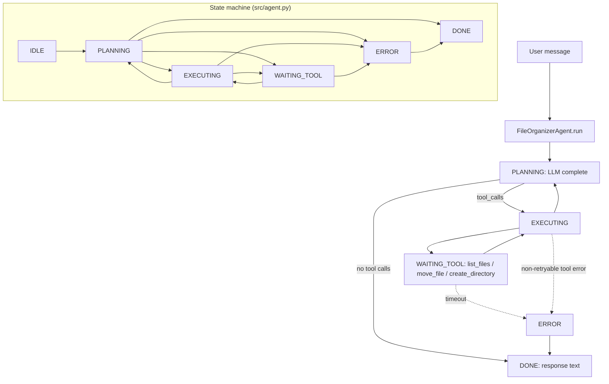

# File Organizer Agent

A minimal **ReAct** agent that organizes files in a target directory by **type** (extension), **modified date**, or **project** (path prefix). Suitable as a template for the smallest AGENT_SPEC–compliant agent package.

## Audience

Developers and operators who want predictable, tool-grounded file moves with explicit arguments—no shell injection via a single “do anything” tool.

## Quickstart

1. Copy this package into your runtime (or mount it as a workspace).
2. Load `system-prompt.md` as the system message.
3. Register tools from `tools/` with your orchestrator; implement handlers in `src/`.
4. Run behavioral checks described in `tests/`.

## Configuration

| Variable | Description |
|----------|-------------|
| `FILE_ORGANIZER_ROOT` | Absolute path cap; the agent must not operate outside this root. |
| `FILE_ORGANIZER_MAX_STEPS` | Upper bound on ReAct iterations per run (default: 20). |

## Architecture

High-level flow: the model plans with **Reasoning + Acting**, calls typed tools, observes structured results, and stops when the user goal is satisfied or limits are hit.

```
                    +------------------+
                    |   User / API     |
                    +--------+---------+
                             |
                             v
                    +--------+---------+
                    |  Orchestrator    |
                    |  (ReAct loop)    |
                    +--------+---------+
                             |
              +--------------+--------------+
              |              |              |
              v              v              v
       +-----------+ +-----------+ +---------------+
       | list_files| | move_file | |create_directory|
       +-----+-----+ +-----+-----+ +-------+-------+
             |             |               |
             v             v               v
       +-----------------------------------------+
       |           Local filesystem            |
       |     (bounded by FILE_ORGANIZER_ROOT)    |
       +-----------------------------------------+
```

## Testing

See `tests/` for scenario-based behavioral specs. Implementations should map these to automated tests (mocked FS) in CI.

## Related files

- `system-prompt.md` — agent instructions
- `tools/` — tool contracts
- `src/` — loop and tool adapters
- `deploy/` — deployment and ops notes

## Architecture diagram (runtime + state machine)

States and transitions are defined in `src/agent.py` as `AgentState`: `IDLE`, `PLANNING`, `EXECUTING`, `WAITING_TOOL`, `ERROR`, `DONE`.



## Environment matrix

| Variable | Required | Default | Description |
|----------|----------|---------|-------------|
| `FILE_ORGANIZER_ROOT` | yes | — | Absolute workspace root; operations must stay bounded here |
| `FILE_ORGANIZER_MAX_STEPS` | no | `20` | Max ReAct iterations per `run()` |
| `MODEL_API_KEY` (or provider equivalent) | yes* | — | LLM credentials (*omit only with on-prem model) |

`AgentConfig` in code also sets `max_wall_time_s` (default `120`), `max_spend_usd` (`1.0`), `tool_timeout_s` (`30`) — map to env in your HTTP wrapper if operators need to tune them.

## Known limitations

- **No automatic filesystem undo:** Successful `move_file` calls are only reversible via `move_log` and your own scripts.
- **Default stubs:** `default_registry` returns `NOT_IMPLEMENTED` until real tool handlers are wired.
- **Tool timeout:** Long listings or slow disks can hit `tool_timeout_s` and surface as `ERROR`.
- **LLM mistakes:** Incorrect destinations are not blocked by the loop beyond tool validation — review high-risk directories.
- **Single executor per call:** Tools run sequentially within a turn; no parallel file ops from the agent core.

**Workarounds:** Dry-run with copies; enforce path canonicalization inside tools; export `audit_log` / `move_log` to object storage for replay.

## Security summary

- **Data flow:** Reads user text and LLM outputs; writes conversation to `session.messages`; tools read/list/move files under the configured root; `audit_log` stores tool name, args, timestamp, `result_ok`; `move_log` stores successful move src/dest.
- **Trust boundaries:** Model may only invoke `list_files`, `move_file`, `create_directory`. Actual privilege is that of the process implementing those tools.
- **Sensitive data handling:** File paths and snippets may appear in chat and logs — classify logs like filesystem access; avoid sending secrets in user prompts; rotate API keys via secret manager.

## Rollback guide

- **Undo file moves:** Walk `session.move_log` newest-first and move each `destination` back to `src` (or restore from backup).
- **Audit log:** Entries include `ts`, `tool`, `args`, `result_ok` for every invocation.
- **Recovery:** Use `save_state` / `load_state` JSON to resume; if state is corrupt, delete the state file and re-run from a known tree snapshot; pair with VCS or snapshots for large reorganizations.

## Memory strategy

- **Ephemeral state:** Conversation turns, current organization plan, batch queues, verification notes, and the in-session **move log** (unless the host persists session JSON). Tool transcripts in the active ReAct window.
- **Durable state:** Optional host-persisted session snapshots (`save_state` / `load_state`), exported `audit_log` / `move_log` in operator-chosen storage, and any user-approved rule presets the host stores outside this package.
- **Retention policy:** Conversation and verbose listings should be trimmed after summary; retain `move_log` until the user confirms completion or through rollback—align log retention with filesystem backup policy (typical operational range: 30–365 days for audit exports, configurable).
- **Redaction rules:** Do not persist API keys, connection strings, or file contents that resemble secrets in logs; treat path lists as sensitive where they reveal product structure. Never store credentials in `FILE_ORGANIZER_*` env values in repo-backed state files.
- **Schema migration:** Version persisted state (e.g., `state_version` in JSON); on breaking changes to `session` or log entry shape, provide a one-shot migrator or require discarding stale state files and cold-starting from a known directory snapshot.
