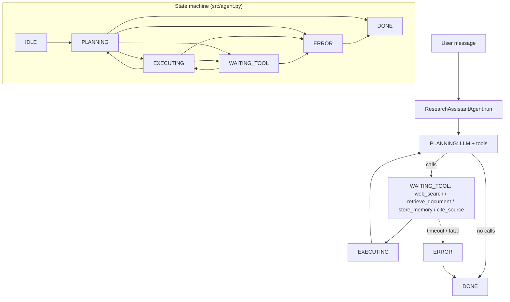

# Research Assistant Agent

A **ReAct + RAG** agent that searches multiple sources, retrieves documents, maintains **session memory**, and answers with **explicit citations**.

## Audience

Analysts, engineers, and PMs who need traceable research: every non-trivial claim should tie to a retrieved or web-fetched source.

## Quickstart

1. Load `system-prompt.md` as the system message.
2. Register tools from `tools/` (web search, retrieval, memory, citation helper).
3. Configure vector store / document index URLs via environment variables.
4. Validate scenarios in `tests/` in CI with mocked search and retrieval.

## Configuration

| Variable | Description |
|----------|-------------|
| `RESEARCH_MEMORY_STORE` | URI for durable memory backend (or `memory://` for dev) |
| `RESEARCH_DOC_INDEX` | Retrieval endpoint or collection id |
| `RESEARCH_MAX_WEB_RESULTS` | Cap on web hits per query |

## Architecture

```
 +-------------+     +-------------------+     +------------------+
 | User / API  |---->| ReAct orchestrator |---->| Model (plan/act)  |
 +-------------+     +---------+---------+     +---------+--------+
                               |                           |
           +-------------------+---------------------------+
           |                   |                           |
           v                   v                           v
   +---------------+   +---------------+           +---------------+
   |  web_search   |   |retrieve_document|         | store_memory  |
   +-------+-------+   +-------+-------+         +-------+-------+
           |                   |                           |
           v                   v                           v
   +---------------+   +---------------+           +---------------+
   | Search provider|   | Vector / DB   |           | Memory store  |
   +---------------+   +---------------+           +---------------+
                               |
                               v
                       +---------------+
                       |  cite_source  |  (format + validate cites)
                       +---------------+
```

## Memory model

- **Working context:** recent turns + tool outputs in the message window.
- **Durable memory:** user/session-scoped notes via `store_memory` (see tool contract for keys and TTL).

## Testing

Behavioral specs live under `tests/`; automate with fixture documents and mocked HTTP.

## Related files

- `system-prompt.md`, `tools/`, `src/agent.py`, `deploy/README.md`

## Architecture diagram (runtime + state machine)

`AgentState` in `src/agent.py`: `IDLE`, `PLANNING`, `EXECUTING`, `WAITING_TOOL`, `ERROR`, `DONE`.



## Environment matrix

| Variable | Required | Default | Description |
|----------|----------|---------|-------------|
| `RESEARCH_MEMORY_STORE` | yes | — | Durable memory backend URI (or `memory://` in dev) |
| `RESEARCH_DOC_INDEX` | yes | — | Retrieval endpoint or collection id |
| `RESEARCH_MAX_WEB_RESULTS` | no | `5` (typical) | Cap on web hits per query; also enforced in `ResearchAgentConfig.max_web_results` |
| Search provider key (e.g. `BING_SEARCH_KEY`) | yes* | — | *If web search enabled |

Code defaults: `max_steps` `20`, `max_wall_time_s` `120`, `max_spend_usd` `1.0`, `tool_timeout_s` `10`.

## Known limitations

- **Retrieval quality:** Answers depend on index freshness and chunking; stale docs produce confident wrong citations.
- **Web dependency:** Provider outages or rate limits surface as tool errors or truncated results.
- **Citation tool contract:** Mis-implemented `cite_source` weakens auditability of claims.
- **Session cost:** Long research loops can exhaust `max_spend_usd` / `max_steps` mid-investigation.
- **No built-in PII redaction:** User queries and retrieved text may contain secrets or personal data.

**Workarounds:** Cache hot queries; validate citations in post-processing; use allowlisted domains; log trace ids without raw document bodies (see deploy README).

## Security summary

- **Data flow:** User text → LLM; tools read external search/index APIs and memory; `session.messages` holds full tool JSON; `citations` accumulates structured cite records; `audit_log` records each tool call; `move_log` tracks successful `store_memory` keys.
- **Trust boundaries:** Network egress is limited to whatever the tool implementations allow (search, vector DB, memory store).
- **Sensitive data handling:** Treat transcripts and retrieval payloads as confidential; store API keys in a vault; avoid logging full page HTML or credentials from search hits.

## Rollback guide

- **Memory writes:** Inspect `session.move_log` entries with `kind: memory` and delete or version keys in the memory store implementation if a bad `store_memory` occurred.
- **Audit log:** `ts`, `tool`, `args`, `ok` per call — use for incident replay, not automatic undo.
- **Recovery:** `save_state` / `load_state` for conversation resume; for bad answers without side effects, discard session state and re-query with tightened retrieval filters.
