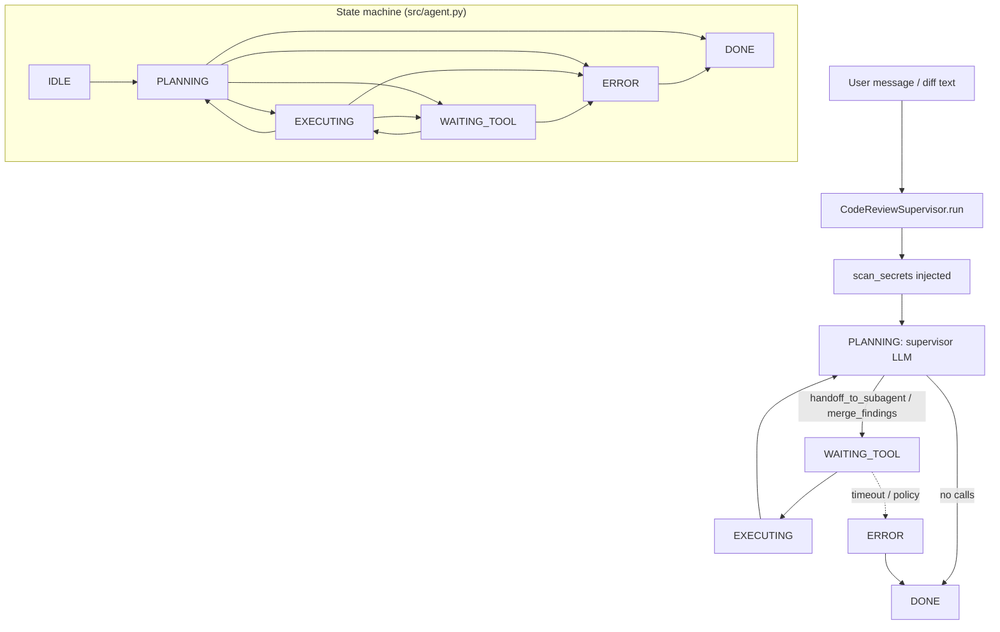

# Code Review Agent

Multi-agent code review system using a supervisor pattern to coordinate specialized sub-reviewers for security, style, and logic analysis.

## Architecture

```
                    ┌──────────────┐
                    │  Supervisor  │
                    │  (router)    │
                    └──────┬───────┘
                           │
              ┌────────────┼────────────┐
              ▼            ▼            ▼
     ┌────────────┐ ┌────────────┐ ┌────────────┐
     │  Security  │ │   Style    │ │   Logic    │
     │  Reviewer  │ │  Reviewer  │ │  Reviewer  │
     └────────────┘ └────────────┘ └────────────┘
              │            │            │
              └────────────┼────────────┘
                           ▼
                    ┌──────────────┐
                    │   Merge      │
                    │   Findings   │
                    └──────────────┘
```

The supervisor receives the diff, routes it to all three sub-reviewers in parallel, collects findings, deduplicates overlapping issues, and produces a unified review report ranked by severity.

## Tools

- `handoff_to_subagent` — Route diff to a specialized reviewer
- `merge_findings` — Combine and deduplicate results from sub-reviewers
- `scan_secrets` — Detect credential patterns in diffs
- `check_injection_patterns` — Identify injection vulnerabilities
- `lint_style_conventions` — Check code style compliance
- `analyze_control_flow` — Detect logic bugs and unreachable code

## Quickstart

```bash
python src/agent.py --diff path/to/diff.patch
```

## Environment variables

| Variable | Required | Description |
|----------|----------|-------------|
| `MODEL_API_KEY` | Yes | Model API key (set in environment, not in code) |
| `REVIEW_MAX_FILES` | No | Max files to review per run (default: 50) |
| `REVIEW_SEVERITY_THRESHOLD` | No | Minimum severity to report: low, medium, high (default: low) |

## Architecture diagram (runtime + state machine)

`CodeReviewSupervisor` uses `AgentState` in `src/agent.py`: `IDLE`, `PLANNING`, `EXECUTING`, `WAITING_TOOL`, `ERROR`, `DONE`. The first turn runs `scan_secrets` before the main LLM loop; sub-reviewers are reachable only via `handoff_to_subagent`.



## Environment matrix

| Variable | Required | Default | Description |
|----------|----------|---------|-------------|
| `MODEL_API_KEY` | yes* | — | LLM access (*or equivalent for your provider) |
| `REVIEW_MAX_FILES` | no | `50` | Hard cap on files in a handoff (`CodeReviewConfig.max_files`) |
| `REVIEW_SEVERITY_THRESHOLD` | no | `low` | Filter for reported findings in reporting layer (not enforced in core loop) |

`CodeReviewConfig` defaults: `max_handoffs` `8`, `max_steps` `20`, `max_wall_time_s` `120`, `max_spend_usd` `1.0`, `tool_timeout_s` `45`.

## Known limitations

- **Diff-only context:** Findings quality depends on patch completeness; surrounding file context may be missing.
- **Heuristic scanners:** `scan_secrets` and pattern tools can false-positive or miss encoded secrets.
- **Handoff budget:** `max_handoffs` stops new subagent routing mid-run — large reviews may need splitting.
- **No auto-fix:** The agent reports issues; it does not apply code changes.
- **Parallelism is tool-level:** The Python loop executes tool calls sequentially per model turn.

**Workarounds:** Split huge diffs; tune severity thresholds downstream; combine with human review for high-risk merges.

## Security summary

- **Data flow:** Full diff text in `user_message` and `session.messages`; `scan_secrets` reads that text; handoffs pass file lists and reviewer names; `audit_log` stores tool args; `findings_batches` aggregates sub-reviewer output.
- **Trust boundaries:** Tools run in your process — they can read any paths your handlers expose. The model cannot bypass `handoff_to_subagent` for subagent-only scanners (direct sub-tool calls return `POLICY`).
- **Sensitive data handling:** Diffs may contain credentials — treat logs and LLM payloads as secret-bearing; use ephemeral storage and data-processing agreements for third-party models.

## Rollback guide

- **No repo mutations in core:** “Rollback” is discarding the review artifact and re-running with a new model version or tools.
- **Audit log:** Each tool invocation logged with `ts`, `tool`, `args` — use for compliance evidence.
- **Recovery:** `save_state` / `load_state` restores `reviewers_done`, `findings_batches`, `handoffs`; delete state file to restart a stuck review.
