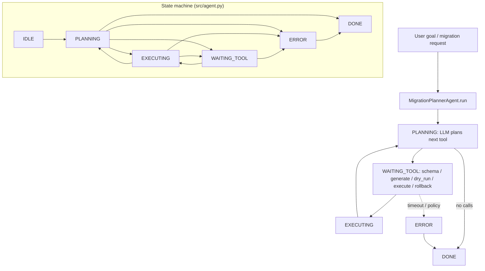

# Migration Planner Agent (Plan-and-Execute)

A **plan-and-execute** agent for **database** and **infrastructure** migrations: it produces an ordered plan with **dependencies** and **rollback** steps, then executes **one step at a time** with verification.

## Audience

SREs and backend engineers running controlled schema or infra changes with auditable steps.

## Quickstart

1. Load `system-prompt.md`.
2. Register tools from `tools/`.
3. Point `MIGRATION_TARGET_DSN` (or cloud API) at a **non-prod** environment first.

## Configuration

| Variable | Description |
|----------|-------------|
| `MIGRATION_TARGET_DSN` | Connection string name in vault (not raw in env in prod) |
| `MIGRATION_ALLOW_EXECUTE` | `false` in plan-only mode |
| `MIGRATION_MAX_STEPS` | Cap per run |

## Architecture

```
 +-------------+     +------------------+
 | User / CI   |---->| Plan-and-Execute |
 |             |     |   orchestrator   |
 +-------------+     +--------+---------+
                              |
          +-------------------+-------------------+
          |                   |                   |
          v                   v                   v
 +----------------+  +----------------+  +----------------+
 | analyze_schema |  |generate_migration|  |    dry_run     |
 +--------+-------+  +--------+-------+  +--------+-------+
          |                   |                   |
          v                   v                   v
 +----------------+  +----------------+  +----------------+
 | Catalog / ORM  |  | Migration DSL  |  | Shadow / txn   |
 +----------------+  +----------------+  +----------------+
          |
          v
 +----------------+          +----------------+
 | execute_step   | <------> | rollback_step  |
 +----------------+          +----------------+
```

Execution **never** skips planning for mutating operations: `generate_migration` and `dry_run` precede `execute_step`.

## Testing

See `tests/` for plan-then-execute ordering assertions.

## Related files

- `system-prompt.md`, `tools/`, `src/agent.py`, `deploy/README.md`

## Architecture diagram (runtime + state machine)

`MigrationPlannerAgent` uses `AgentState` in `src/agent.py`: `IDLE`, `PLANNING`, `EXECUTING`, `WAITING_TOOL`, `ERROR`, `DONE`. Plan-and-execute tools: `analyze_schema`, `generate_migration`, `dry_run`, `execute_step`, `rollback_step`.



## Environment matrix

| Variable | Required | Default | Description |
|----------|----------|---------|-------------|
| `MIGRATION_TARGET_DSN` | yes | — | Vault reference / connection to target (never raw secrets in git) |
| `MIGRATION_ALLOW_EXECUTE` | yes | `false` | When `false`, plan-only; mutating `execute_step` must stay gated in prod |
| `MIGRATION_MAX_STEPS` | no | `20` | Matches `MigrationConfig.max_steps` if wired |
| `MIGRATION_REQUIRE_DRY_RUN` | no | `true` | Aligns with `MigrationConfig.require_dry_run` |

Code defaults: `max_wall_time_s` `120`, `max_spend_usd` `1.0`, `tool_timeout_s` `60`.

## Known limitations

- **Blast radius:** Incorrect `execute_step` can still harm shared databases — policy must live outside the LLM.
- **Dry-run fidelity:** Shadow DBs may diverge from production statistics and locks.
- **Long plans:** Wall-time and step caps can truncate multi-hour migrations.
- **Rollback coverage:** `rollback_step` quality depends on generated SQL and whether DDL is reversible.
- **Single-agent sequencing:** No built-in multi-DB coordination.

**Workarounds:** Always start in plan-only mode; use maintenance windows; keep human approval between `dry_run` and `execute_step`; test rollbacks on clones.

## Security summary

- **Data flow:** User text and tool outputs in `session.messages`; tools touch schema catalogs and migration stores; `audit_log` and `move_log` record executed steps and metadata per implementation.
- **Trust boundaries:** Credentials resolve via your vault + tool handlers; the agent never bypasses `MIGRATION_ALLOW_EXECUTE` unless your wrapper does.
- **Sensitive data handling:** DSNs and schema dumps are highly sensitive — redact logs; restrict who can set `allow_execute: true`.

## Rollback guide

- **After bad execute:** Invoke `rollback_step` with the recorded `migration_id` or apply manual down-migration from your artifact store.
- **Audit log:** Use entries to reconstruct order of `analyze_schema` / `generate_migration` / `dry_run` / `execute_step`.
- **Recovery:** `save_state` / `load_state` tracks `planned_steps`, `dry_ok`, `executed` — restore DB from backup if logical rollback is impossible; re-run agent from clean state file after incident.
