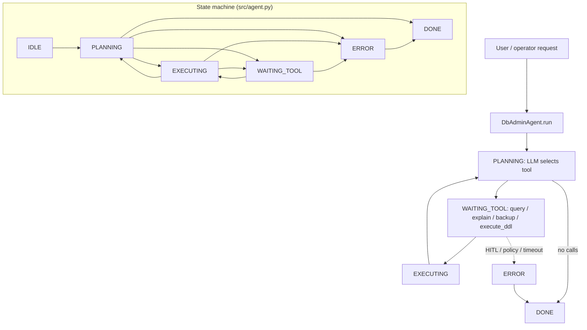

# Database Admin Agent (Safety-Critical)

A **safety-critical** agent for **read-mostly** operations and **strictly gated** DDL. Every **destructive** or **schema-changing** path requires **human-in-the-loop (HITL)** approval enforced by the runtime, not merely suggested in prose.

## Audience

DBAs and platform engineers who want an LLM assistant that **cannot** bypass organization policy: least privilege, backups before DDL, and query explain-before-run patterns.

## Quickstart

1. Load `system-prompt.md`.
2. Wire tools in `src/agent.py` with **hard gates** (see `deploy/README.md`).
3. Start in **read-only** profile: only `query_db` (SELECT) and `explain_query` enabled.

## Configuration

| Variable | Description |
|----------|-------------|
| `DB_ADMIN_DSN_REF` | Vault reference to read/write credentials (separate RO user recommended) |
| `DB_ADMIN_HITL_TOKEN` | Approver-issued token consumed by `execute_ddl` |
| `DB_ADMIN_SANDBOX_SCHEMA` | Optional schema prefix for trial DDL |

## Architecture

```
 +----------------+       +-------------------+
 | User / ticket  |------>| DB Admin Agent    |
 +----------------+       | (policy + tools)  |
                            +---------+---------+
                                      |
            +-------------------------+-------------------------+
            |                         |                         |
            v                         v                         v
    +---------------+         +---------------+         +---------------+
    |   query_db    |         | explain_query |         | backup_table  |
    |  (SELECT-only |         | (plan + cost) |         | (pre-DDL snap)|
    |   in RO mode) |         +---------------+         +---------------+
    +---------------+                                           |
            \------------------------------------------------------+
                                      |
                                      v
                            +---------------+
                            | execute_ddl   | <--- HITL gate + backup id
                            +---------------+
                                      |
                                      v
                            +---------------+
                            |   Database    |
                            | (sandboxed)   |
                            +---------------+
```

## Safety layers

1. **Network / identity:** dedicated DB role with column/table grants.
2. **Sandbox:** optional schema; block `DROP DATABASE`, `TRUNCATE` unless explicit break-glass role.
3. **HITL:** `execute_ddl` requires valid approval payload from ticketing system.
4. **Backup:** `backup_table` (or snapshot) must precede risky DDL per policy.

## Testing

See `tests/` for HITL and read-only enforcement scenarios.

## Related files

- `system-prompt.md`, `tools/`, `src/agent.py`, `deploy/README.md`

## Architecture diagram (runtime + state machine)

`DbAdminAgent` uses `AgentState` in `src/agent.py`: `IDLE`, `PLANNING`, `EXECUTING`, `WAITING_TOOL`, `ERROR`, `DONE`. Tools: `query_db`, `explain_query`, `backup_table`, `execute_ddl` (gated).



## Environment matrix

| Variable | Required | Default | Description |
|----------|----------|---------|-------------|
| `DB_ADMIN_DSN_REF` | yes | — | Vault reference for DB credentials (RO/RW split recommended) |
| `DB_ADMIN_HITL_TOKEN` / approval flow | yes* | — | *Required when `execute_ddl` is allowed — matches runtime HITL integration |
| `DB_ADMIN_SANDBOX_SCHEMA` | no | — | Optional namespace for trial DDL |
| `DB_ADMIN_READ_ONLY` | yes | `true` | Maps to `DbAdminConfig.read_only_sql` when wired |

Code defaults: `max_steps` `20`, `max_wall_time_s` `120`, `max_spend_usd` `1.0`, `tool_timeout_s` `30`, `require_backup_before_ddl` `false` (enable in prod for risky DDL).

## Known limitations

- **SQL parsing gate:** `validate_query_sql` uses prefix checks — advanced dialects or comments could evade naive policies without stronger parsing.
- **HITL is only as strong as integration:** Fake or replayed `approval_id` handling must be enforced server-side.
- **Backup tool semantics:** `backup_table` must be implemented to match your RTO/RPO; the skeleton does not guarantee snapshots.
- **LLM-generated DDL:** Still requires human verification before approval tokens are issued.
- **Single connection model:** High concurrency needs external pooling and session limits.

**Workarounds:** Use database-native ACLs; mandatory `explain_query` before DDL; separate break-glass roles; enable `require_backup_before_ddl`.

## Security summary

- **Data flow:** User questions and SQL snippets in chat; tools read/write the database per role; `session` tracks `approval_id`, `last_backup_id`, `audit_log`, `move_log`.
- **Trust boundaries:** The DB is the critical boundary — least-privilege DB users, network ACLs, and vault-backed DSNs.
- **Sensitive data handling:** Query results may contain PII — mask in tool responses; never log full DSNs; rotate RW credentials on incident.

## Rollback guide

- **After bad DDL:** Restore from `backup_table` / storage snapshot referenced by `last_backup_id`; replay corrective DDL from ticketing.
- **Audit log:** Log every `execute_ddl` with `approval_id`, operator identity, and idempotency key (see deploy README).
- **Recovery:** `save_state` / `load_state` for session; kill inflight transactions on DB side if agent stuck; revoke HITL tokens after misuse.
