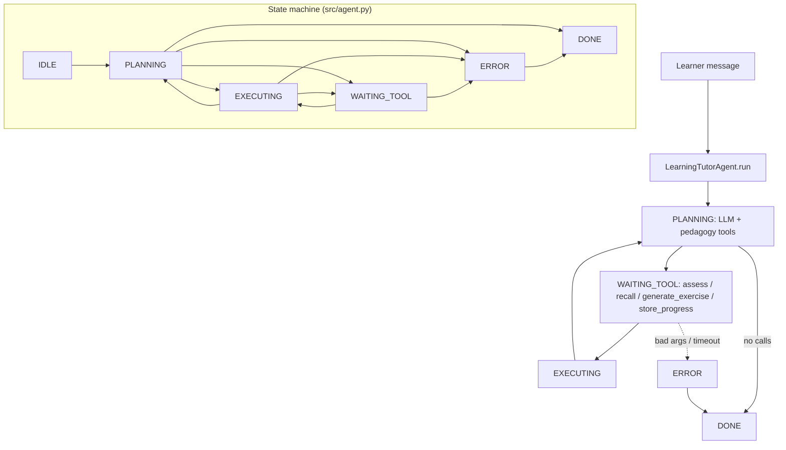

# Learning Tutor Agent

**Pattern:** Memory-heavy personalized tutoring  
**Goal:** Track learner progress, adapt difficulty, and retain both factual knowledge (semantic) and session-specific facts (episodic) across interactions.

## Architecture

The tutor separates **semantic memory** (stable concepts, curriculum mappings, skill graphs) from **episodic memory** (per-session events, mistakes, emotional cues, timestamps). Tool calls write to and read from these layers; the model prompt encodes when to use each.

```
                    +------------------+
                    |   User / LMS     |
                    +--------+---------+
                             |
                    +--------v---------+
                    |  Tutor Runtime   |
                    |  (orchestration) |
                    +--------+---------+
           +---------+--------+---------+---------+
           |                  |                   |
    +------v------+   +-------v-------+   +-------v-------+
    | assess_     |   | generate_     |   | store_        |
    | knowledge   |   | exercise      |   | progress      |
    +------+------+   +-------+-------+   +-------+-------+
           |                  |                   |
           +------------------+-------------------+
                              |
              +---------------v---------------+
              |      recall_history (read)     |
              +---------------+---------------+
                              |
         +--------------------+--------------------+
         |                                         |
  +------v------+                         +--------v--------+
  |  Semantic   |                         |   Episodic      |
  |  store      |                         |   store         |
  | (skills,    |                         | (sessions,      |
  |  rubrics)   |                         |  attempts)      |
  +-------------+                         +-----------------+
```

**Data flow:** `assess_knowledge` and `recall_history` inform the next turn; `generate_exercise` consumes difficulty tags from both memory layers; `store_progress` appends episodic events and updates semantic aggregates (e.g., mastery scores).

## Contents

| Path | Purpose |
|------|---------|
| `system-prompt.md` | Persona, memory rules, tool-use policy |
| `tools/` | JSON-oriented specs per tool |
| `tests/` | Behavioral scenarios |
| `src/` | Skeleton runtime wiring |

## Operational notes

- Persist episodic records with stable `learner_id` and monotonic `sequence` or timestamps.
- Refresh semantic summaries on a schedule or after N new episodic writes to avoid drift.

## Architecture diagram (runtime + state machine)

`LearningTutorAgent` uses `AgentState` in `src/agent.py`: `IDLE`, `PLANNING`, `EXECUTING`, `WAITING_TOOL`, `ERROR`, `DONE`. Tools: `assess_knowledge`, `generate_exercise`, `store_progress`, `recall_history`.



## Environment matrix

| Variable | Required | Default | Description |
|----------|----------|---------|-------------|
| `TUTOR_LEARNER_ID` | yes* | — | *Or pass per session — matches `TutorAgentConfig.learner_id` |
| Semantic / episodic store URIs | yes | — | Implementations behind `assess_knowledge`, `recall_history`, `store_progress` |
| `MODEL_API_KEY` | yes* | — | *Unless self-hosted LLM |

Code defaults: `max_steps` `20`, `max_wall_time_s` `120`, `max_spend_usd` `1.0`, `tool_timeout_s` `45`.

## Known limitations

- **No FERPA/COPPA automation:** Compliance is organizational — the agent does not anonymize learners by default.
- **Memory drift:** Semantic aggregates can desync from episodic logs without scheduled reconciliation jobs.
- **Exercise quality:** Generated items may be wrong or off-level without human curriculum review.
- **Stub stores:** Default tools must be implemented for durable progress.
- **Single `learner_id` per config:** Multi-tenant apps should instantiate one agent/config per learner session.

**Workarounds:** Human-in-the-loop for assessments that affect grades; versioned rubrics; export `mutation_log` for audit.

## Security summary

- **Data flow:** Learner prompts, tool JSON, and model text in `session.messages`; `audit_log` and `mutation_log` track tool side effects (`assess_knowledge`, `store_progress` are mutating per `_MUTATING`).
- **Trust boundaries:** PII lives in your LMS + memory backends; the LLM provider is a secondary boundary — use BAAs / DPAs as required.
- **Sensitive data handling:** Minimize free-text about minors in logs; encrypt stores at rest; allow parent/guardian data deletion workflows outside the agent.

## Rollback guide

- **Bad progress write:** Use `mutation_log` entries to revert or tombstone the affected records in your episodic/semantic store implementation.
- **Audit log:** Full tool trace for compliance review — not an automatic undo.
- **Recovery:** `save_state` / `load_state`; for corrupted pedagogy state, reset learner session object and re-import last known good mastery snapshot from LMS.

## Memory strategy

- **Ephemeral state:** Draft explanations, scratch work, transient tone adjustments, and tool transcripts in the current tutoring turn (until written via tools or session ends).
- **Durable state:** Semantic aggregates and episodic events via `assess_knowledge`, `store_progress`, and `recall_history` backends; optional `save_state` / `load_state` for host resume—**scoped per `learner_id`**.
- **Retention policy:** Follow institutional ed-tech policy (e.g., academic year + statutory holds); refresh semantic summaries on a schedule or after N episodic writes to limit drift. Purge or anonymize on withdrawal requests.
- **Redaction rules:** Do not store unredacted PII (names, emails, exact scores tied to identity) in long-term memory; minimize safeguarding-related free text in logs. Never mix two learners’ records in one store key.
- **Schema migration:** Version semantic/episodic records; use additive fields and backfills when changing rubric or mastery score shapes; reject cross-version reads without migration to avoid corrupt placement.
