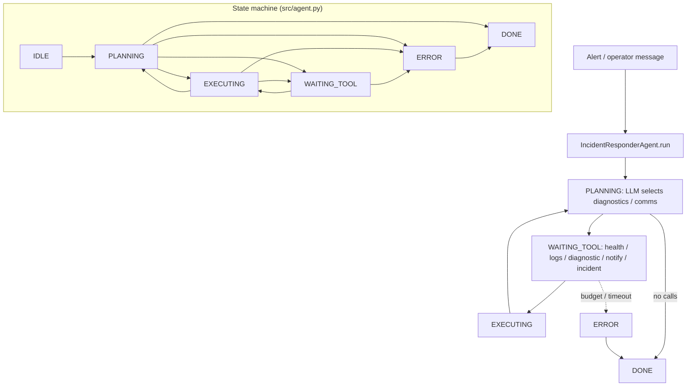

# Incident Responder Agent

**Pattern:** Autonomous monitoring loop with bounded autonomy  
**Goal:** Detect unhealthy signals, run safe diagnostics, open incidents, and escalate to humans when thresholds or step limits are hit.

## Architecture

The responder runs a **sense → diagnose → act → record** loop. **Circuit breakers** halt automated remediation when blast radius is unclear or repeated actions fail. **Escalation** triggers when severity, customer impact, or autonomy budget is exceeded.

```
  +-------------+     +-------------+     +---------------+
  | check_health|---->| query_logs  |---->| run_diagnostic|
  +------+------+     +------+------+     +-------+-------+
         |                    |                    |
         |           +--------v---------+          |
         |           |  Policy engine   |          |
         |           | (thresholds +    |          |
         |           |  max auton.      |          |
         |           |  steps)          |          |
         |           +--------+---------+          |
         |                    |                      |
         v                    v                      v
  +-------------+     +-------------+     +---------------+
  | (loop or    |     |notify_oncall|     |create_incident|
  |  handoff)   |     |  (optional) |     |  (ticket)     |
  +-------------+     +-------------+     +---------------+
```

**Bounded autonomy:** Each incident run carries a `max_autonomous_steps` counter; when exhausted, the agent **must** stop mutating state and **notify_oncall** with a structured handoff summary.

## Contents

| Path | Purpose |
|------|---------|
| `system-prompt.md` | Circuit breakers, thresholds, step budget |
| `tools/` | Health, logs, diagnostics, comms, ticketing |
| `tests/` | Escalation behavior |
| `src/` | Loop skeleton |

## Safety

- Default-deny destructive remediation unless explicitly in allowlist for the environment.
- All automated actions must be idempotent where possible and fully logged.

## Architecture diagram (runtime + state machine)

`IncidentResponderAgent` uses `AgentState` in `src/agent.py`: `IDLE`, `PLANNING`, `EXECUTING`, `WAITING_TOOL`, `ERROR`, `DONE`. Tools include `check_health`, `query_logs`, `run_diagnostic`, `notify_oncall`, `create_incident`; autonomy budget applies to non-`check_health` tools.



## Environment matrix

| Variable | Required | Default | Description |
|----------|----------|---------|-------------|
| Observability endpoints (metrics/logs) | yes | — | Wired inside tool implementations for `check_health` / `query_logs` |
| Ticketing / paging API keys | yes* | — | *If `create_incident` / `notify_oncall` enabled |
| `INCIDENT_MAX_AUTONOMY` | no | `12` | Align with `IncidentAgentConfig.autonomous_tool_budget` |
| `MODEL_API_KEY` | yes* | — | *Unless on-prem |

Code defaults: `max_steps` `20`, `max_wall_time_s` `120`, `max_spend_usd` `1.0`, `tool_timeout_s` `60`.

## Known limitations

- **False positives:** Health checks can be green while user-impacting failures continue — combine signals.
- **Log volume:** `query_logs` windows may truncate or cost heavily on busy services.
- **Autonomy cap:** When `autonomous_tool_budget` is exhausted, the agent must stop mutating — may leave incidents partially diagnosed.
- **No guaranteed runbook correctness:** LLM may skip policy-ordered steps unless enforced in code.
- **Third-party rate limits:** Paging and ticketing APIs can block escalation.

**Workarounds:** Hard-code runbook phases in the wrapper; mirror alerts to humans early; use allowlisted diagnostic routines only.

## Security summary

- **Data flow:** Incident text flows to LLM and logs; tools may read production telemetry; `notify_oncall` / `create_incident` write to external comms; `audit_log` + `mutation_log` capture tool args and mutating calls.
- **Trust boundaries:** Production read access is high risk — use read-only service accounts and short-lived tokens; separate prod vs staging tool routing.
- **Sensitive data handling:** Scrub customer PII from log excerpts before model or ticket bodies; classify on-call messages as confidential.

## Rollback guide

- **Erroneous ticket/page:** Close or update the incident in the ticketing system using IDs from `mutation_log`; send corrective `notify_oncall` only through approved channels.
- **Audit log:** Reconstruct timeline for post-incident review — not automatic revert of infra changes (those need platform rollback).
- **Recovery:** `save_state` / `load_state`; after runaway loops, disable automated tools at the gateway and reset session state.
