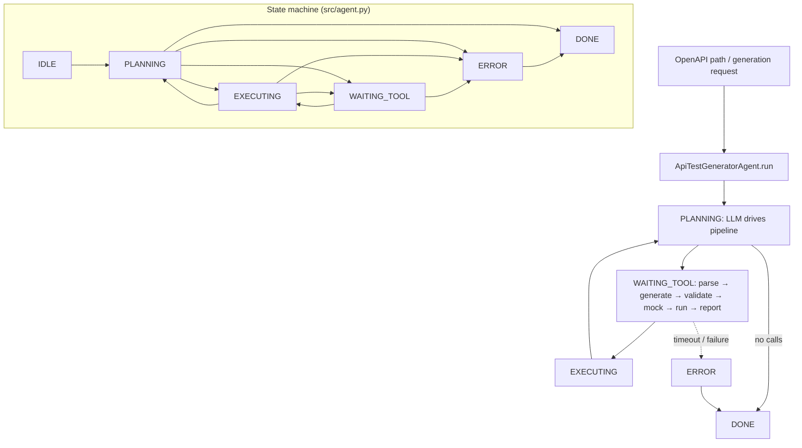

# API Test Generator Agent

**Pattern:** Tool-heavy OpenAPI → executable test suite  
**Goal:** Parse specifications, emit deterministic test cases, validate responses against schemas, run tests, mock dependencies, and produce human-readable reports.

## Architecture

The pipeline is strictly ordered: **parse** → **generate** → **validate** (static) → **mock** (if needed) → **run** → **report**. Structured outputs (JSON/YAML) flow between stages so CI can diff artifacts.

```
   +---------------+
   |  OpenAPI doc  |
   +-------+-------+
           |
   +-------v-------+
   | parse_openapi |
   +-------+-------+
           |
   +-------v------------+      +------------------------+
   | generate_test_case |----->| validate_response_schema|
   +-------+------------+      +-----------+------------+
           |                                 |
   +-------v-------+                (per case)
   |  mock_endpoint | (optional)
   +-------+-------+
           |
   +-------v-------+
   |   run_test    |
   +-------+-------+
           |
   +-------v-------+
   | generate_report|
   +----------------+
```

**Structured output contract:** Generated test files **must** be valid for the project’s runner (e.g., pytest + requests, or k6) and include stable ids for flake tracking.

## Contents

| Path | Purpose |
|------|---------|
| `system-prompt.md` | Schema-first generation **rules** |
| `tools/` | Six tool specifications |
| `tests/` | Behavioral scenario |
| `src/` | Generator skeleton |

## Architecture diagram (runtime + state machine)

`ApiTestGeneratorAgent` uses `AgentState` in `src/agent.py`: `IDLE`, `PLANNING`, `EXECUTING`, `WAITING_TOOL`, `ERROR`, `DONE`. Pipeline tools: `parse_openapi`, `generate_test_case`, `validate_response_schema`, `mock_endpoint`, `run_test`, `generate_report`.



## Environment matrix

| Variable | Required | Default | Description |
|----------|----------|---------|-------------|
| `OPENAPI_SOURCE` / spec path | yes | — | Input to `parse_openapi` tool implementation |
| Test runner deps (e.g. `pytest`, target base URL) | yes | — | Used by `run_test` handler |
| `MODEL_API_KEY` | yes* | — | *If LLM-driven generation |

Code defaults: `max_steps` `20`, `max_wall_time_s` `120`, `max_spend_usd` `1.0`, `tool_timeout_s` `300` (long for test runs).

## Known limitations

- **Flaky tests:** Generated cases may depend on timing or shared state without the agent knowing.
- **Spec vs reality:** OpenAPI may omit auth quirks or error shapes present in production.
- **Large specs:** Token limits may force partial coverage of operations.
- **Mutable workspace:** `generate_test_case` / `mock_endpoint` write artifacts — conflicts in shared CI checkouts.
- **Secrets in examples:** Spec servers sometimes embed sample keys — scrub before committing output.

**Workarounds:** Pin environments; run generation in isolated worktrees; static analysis on emitted tests; manual review of auth headers.

## Security summary

- **Data flow:** Spec content and generated tests in messages; `run_test` may hit real services; `session.spec_hash` can track spec identity; `audit_log` / `mutation_log` record pipeline steps.
- **Trust boundaries:** Network calls only via your tool implementations — sandbox CI runners and non-prod URLs by default.
- **Sensitive data handling:** OpenAPI and responses may contain PII or API keys — redact fixtures; use secret-free example servers; never log raw auth tokens from `run_test`.

## Rollback guide

- **Bad generated files:** Delete artifacts listed in `mutation_log` or revert the Git commit that added them.
- **Audit log:** Use for CI forensics — which `test_id`s were generated and run.
- **Recovery:** `save_state` / `load_state`; wipe partial output dir and re-run `parse_openapi` from a known spec version.
