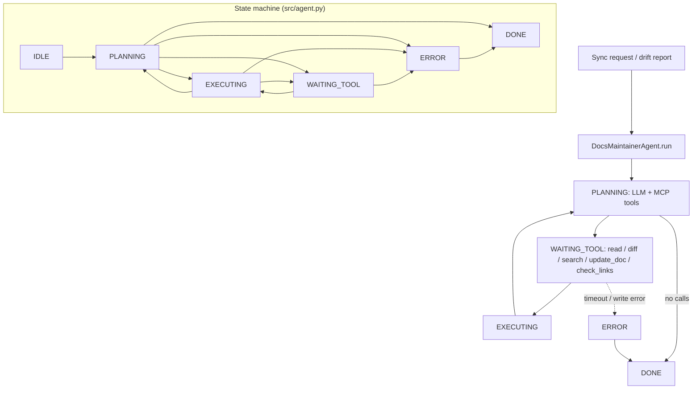

# Docs Maintainer Agent

**Pattern:** MCP-forward documentation sync  
**Goal:** Discover code changes, reconcile documentation, fix broken links, and search the codebase using **MCP**-hosted tools for consistent retrieval across editors and CI.

## Architecture

The agent is **MCP-forward**: the host discovers capabilities via **MCP** `tools/list` (or equivalent) and routes model **function calling** to those registered tools. **Multi-source retrieval** combines git diffs, file reads, and semantic search before any doc edit.

```
                    +------------------+
                    |   MCP Host       |
                    | (Cursor / CI)    |
                    +--------+---------+
                             |
              tools/list + resources
                             |
        +--------------------+--------------------+
        |                    |                    |
 +------v------+      +------v------+      +------v------+
 | read_source |      | diff_changes|      |search_codebase|
 +------+------+      +------+------+      +------+------+
        |                    |                    |
        +--------------------+--------------------+
                             |
                      +------v------+
                      |  update_doc |
                      +------+------+
                             |
                      +------v------+
                      | check_links |
                      +-------------+
```

**Epistemic split:** `read_source` / `search_codebase` ground truth in the repo; `diff_changes` scopes edits; `update_doc` applies patches; `check_links` validates outbound integrity.

## Contents

| Path | Purpose |
|------|---------|
| `system-prompt.md` | MCP discovery + retrieval **rules** |
| `tools/` | MCP tool schemas (documented) |
| `tests/` | Sync behavior |
| `src/` | Client skeleton |

## Deployment

Register the same tool names on the MCP server so local and CI agents share behavior.

## Architecture diagram (runtime + state machine)

`DocsMaintainerAgent` uses `AgentState` in `src/agent.py`: `IDLE`, `PLANNING`, `EXECUTING`, `WAITING_TOOL`, `ERROR`, `DONE`. Tools: `read_source`, `diff_changes`, `update_doc`, `check_links`, `search_codebase`.



## Environment matrix

| Variable | Required | Default | Description |
|----------|----------|---------|-------------|
| Repo root / `GIT_BASE` & `GIT_HEAD` | yes | — | For `diff_changes` tool |
| MCP server endpoint or local tool registry | yes | — | Host must expose documented tool names |
| `MODEL_API_KEY` | yes* | — | *If using cloud LLM |

Code defaults: `max_steps` `20`, `max_wall_time_s` `120`, `max_spend_usd` `1.0`, `tool_timeout_s` `90`.

## Known limitations

- **MCP parity:** Local Cursor and CI may register different tool versions — drift in behavior.
- **Large repos:** `search_codebase` can return noisy or incomplete results without good ranking.
- **Doc patches:** `update_doc` can corrupt formatting or remove content — review diffs in PRs.
- **Link check flakiness:** External URLs may fail transiently in CI.
- **No automatic merge conflict resolution:** Conflicts with human edits need manual fix.

**Workarounds:** Pin MCP server version; scope `diff_changes` to relevant paths; run `check_links` with retries and allowlists.

## Security summary

- **Data flow:** Reads source and diffs from the repo; `update_doc` writes files; messages may contain code excerpts; `audit_log` / `mutation_log` track reads and writes.
- **Trust boundaries:** Repo access is the main boundary — run with least privilege; MCP host must not expose unrelated workspaces.
- **Sensitive data handling:** Private code stays on-prem when possible; scrub tokens from docs before running against cloud models; treat link targets as potential exfil vectors (SSRF) — validate in tool layer.

## Rollback guide

- **Bad doc edit:** `git revert` the commit or restore file from `mutation_log` + VCS history; `update_doc` patches should be reviewable as standard diffs.
- **Audit log:** Shows sequence of tool args for compliance.
- **Recovery:** `save_state` / `load_state`; delete bad partial state and re-run from clean branch after resetting `last_diff_key`.
