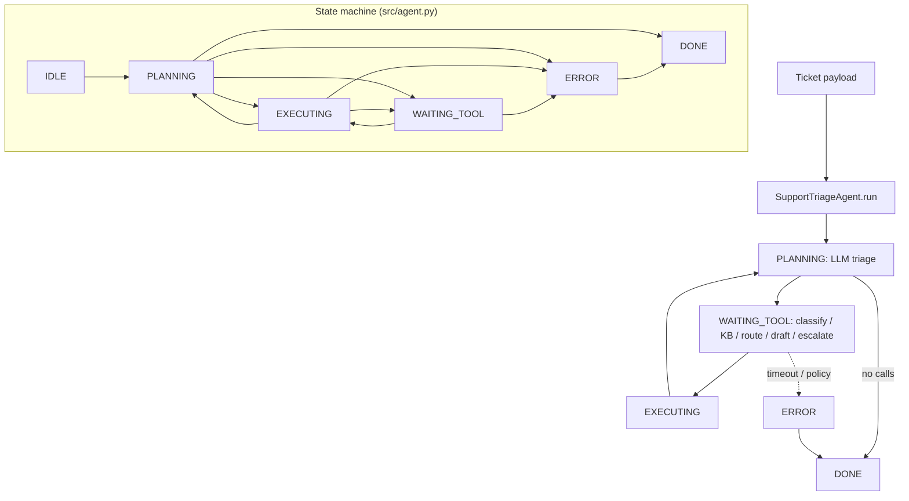

# Support Triage Agent

**Pattern:** Routing + classification  
**Goal:** Classify ticket intent, retrieve knowledge-base evidence, route to the correct queue or specialist agent, draft a first response, and escalate when confidence or policy demands human judgment.

## Architecture

Inbound tickets pass through a **classification** stage producing **structured output** (JSON). **Routing rules** map labels + severity + account tier to destinations. Retrieval and response generation are separate **tool** stages to keep audit trails clean.

```
      +-----------+
      |  Ticket   |
      +-----+-----+
            |
     +------v------+
     |classify_intent|
     +------+------+
            |
    +-------+-------+
    | structured    |
    | labels + conf |
    +-------+-------+
            |
 +----------+----------+
 |                       |
 v                       v
+----------+      +-------v------+
| search_kb|      | route_ticket |
+----------+      +-------+------+
                          |
              +-----------+-----------+
              |                       |
       +------v------+         +------v------+
       |generate_    |         |escalate_to_ |
       |response     |         |human        |
       +-------------+         +-------------+
```

**Structured output contract:** Classification JSON **must** include: `primary_intent`, `secondary_intents`, `urgency`, `sentiment`, `confidence` (0–1), `entities`, `routing_hint`.

## Contents

| Path | Purpose |
|------|---------|
| `system-prompt.md` | Classification schema + routing **rules** |
| `tools/` | Triage tool specs |
| `tests/` | Routing behavior |
| `src/` | Orchestration skeleton |

## Governance

Log every `route_ticket` decision with ticket id and model version for compliance review.

## Architecture diagram (runtime + state machine)

`SupportTriageAgent` uses `AgentState` in `src/agent.py`: `IDLE`, `PLANNING`, `EXECUTING`, `WAITING_TOOL`, `ERROR`, `DONE`. Tools: `classify_intent`, `search_kb`, `route_ticket`, `generate_response`, `escalate_to_human`; routing helpers use confidence and urgency in code.



## Environment matrix

| Variable | Required | Default | Description |
|----------|----------|---------|-------------|
| Ticketing system API (CRM) credentials | yes | — | For tools that mutate tickets |
| KB / search index endpoint | yes* | — | *If `search_kb` uses remote index |
| `MODEL_API_KEY` | yes* | — | *Unless on-prem |

Code defaults: `max_steps` `20`, `max_wall_time_s` `120`, `max_spend_usd` `1.0`, `tool_timeout_s` `45`.

## Known limitations

- **Routing rules are code + model:** `_routing_rule` encodes part of policy — changes need deploys, not prompt-only fixes.
- **Confidence scores:** Model calibration varies; low `confidence` may still route incorrectly.
- **PII in tickets:** Subject/body may flow to LLM and logs — regulatory exposure.
- **KB staleness:** Wrong articles produce plausible wrong replies.
- **Automation backlash:** Auto-`generate_response` can send policy-violating text if not gated.

**Workarounds:** Human approval before send; redact fields pre-model; log `route_ticket` with model version (see Governance); A/B test prompts offline.

## Security summary

- **Data flow:** Ticket text → LLM; KB retrieval → context; `route_ticket` / `generate_response` / `escalate_to_human` write to external systems; `sla_routing_log`, `audit_log`, `mutation_log` capture decisions and side effects.
- **Trust boundaries:** CRM and KB credentials live in the tool layer; enforce tenant isolation per helpdesk account.
- **Sensitive data handling:** Minimize retention of full ticket bodies in logs; use data processing agreements; mask payment identifiers before model calls.

## Rollback guide

- **Wrong route or draft:** Update ticket in CRM using native undo or post a correction; retract unsent drafts at the messaging gateway.
- **Audit log:** Reconstruct classification JSON and tool order for disputes — not automatic CRM undo.
- **Recovery:** `save_state` / `load_state`; after bad automation burst, disable `generate_response` in config and clear session state for affected tickets.
