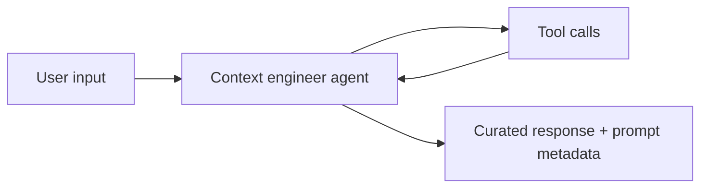
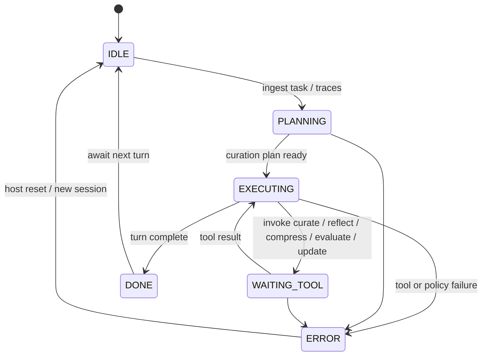

# Context Engineer Agent (ACE Pattern)

An agent specialized in **evolving system prompts**, **context curation**, and **reflection loops**. It implements the **Agent–Context–Evolution (ACE)** pattern: continuously refine what the model sees, how it reasons about failures, and how instructions compress over long sessions.

## Audience

Platform engineers and prompt architects who run long-horizon assistants and need **bounded context**, **auditable prompt changes**, and **quality gates** before promoting new system text.

## Quickstart

1. Load `system-prompt.md` into your host runtime.
2. Register tools from `tools/` with schemas matching each markdown specification.
3. Run `src/agent.py` as a reference loop; wire your LLM client and persistence per `deploy/README.md`.

## Configuration

| Variable | Description |
|----------|-------------|
| `CONTEXT_STORE_URI` | Durable store for curated windows and prompt versions |
| `CONTEXT_MAX_TOKENS` | Hard ceiling for working context after curation |
| `MODEL_API_ENDPOINT` | Upstream chat/completions endpoint (no secrets in repo) |
| `PROMPT_VERSION_NAMESPACE` | Logical namespace for `update_system_prompt` drafts |

## Architecture

```
                         +----------------------+
                         |   User / upstream    |
                         |   task + raw logs    |
                         +----------+-----------+
                                    |
                                    v
                         +----------------------+
                         |   curate_context     |
                         | (select / structure  |
                         |  evidence windows)   |
                         +----------+-----------+
                                    |
            +-----------------------+-----------------------+
            |                       |                       |
            v                       v                       v
 +-------------------+   +-------------------+   +-------------------+
 | evaluate_context_ |   | reflect_on_output |   | compress_context|
 | quality           |   | (failure / success|   | (lossy merge,   |
 | (scores + gaps)   |   |  structured notes)  |   |  summaries)     |
 +---------+---------+   +---------+---------+   +---------+---------+
           |                       |                       |
           +-----------------------+-----------+-----------+
                                               |
                                               v
                                    +----------------------+
                                    | update_system_prompt |
                                    | (draft -> review ->  |
                                    |  version bump)       |
                                    +----------+-----------+
                                               |
                         +---------------------+---------------------+
                         |                                           |
                         v                                           v
                +----------------+                         +----------------+
                | Next turn uses |<---- evolution loop ---->| Audit / rollback|
                | promoted prompt|                         | (host policy)   |
                +----------------+                         +----------------+
```

## Operational loop

1. **Curate** incoming traces into ranked, citeable chunks.
2. **Reflect** on the last model output against task success criteria.
3. **Evaluate** context quality before expensive generation.
4. **Compress** when approaching token limits; preserve constraints and tool contracts.
5. **Evolve** system prompt only when metrics and human or automated review allow.

## Testing

See `tests/` for end-to-end behavioral scenarios.

## Related files

- `system-prompt.md`, `tools/`, `src/agent.py`, `deploy/README.md`

## Runtime architecture (control flow)

End-to-end request path and lifecycle states used by the reference loop in `src/agent.py` and comparable hosts.





## Environment matrix

| Variable | Required | Default | Description |
|----------|----------|---------|-------------|
| `CONTEXT_STORE_URI` | yes | — | Durable store for curated windows, reflections, and prompt version metadata |
| `CONTEXT_MAX_TOKENS` | yes | — | Hard ceiling for working context after curation and compression |
| `MODEL_API_ENDPOINT` | yes | — | Upstream chat/completions endpoint; credentials only via host secret store |
| `PROMPT_VERSION_NAMESPACE` | yes | — | Logical namespace isolating draft vs promoted `update_system_prompt` revisions |
| `REDACTION_RULESET_REF` | no | — | Org redaction patterns applied during `curate_context` |

## Known limitations

- **Lossy compression:** `compress_context` may drop nuance; critical constraints must be tagged or pinned outside the summarizer.
- **Promotion race:** Concurrent writers to the same `PROMPT_VERSION_NAMESPACE` need external locking; the agent assumes host-enforced single-writer or compare-and-swap on hashes.
- **Quality metrics:** `evaluate_context_quality` scores are heuristic; they do not guarantee downstream task success.
- **Long-horizon drift:** Without periodic human or automated review, evolved system prompts can overfit to recent failure modes.
- **Store coupling:** Behavior depends on `CONTEXT_STORE_URI` latency; slow stores inflate `WAITING_TOOL` dwell time and user-visible latency.

## Security summary

- **Data flow:** User/task text and traces enter the agent; tools read/write the context store and prompt registry; model calls leave the boundary only to `MODEL_API_ENDPOINT` as configured by the host.
- **Trust boundaries:** Treat the LLM as untrusted for instruction injection; treat curated bundles as **sensitive** if they contain customer content; the context store and prompt registry are **trust anchors** for integrity and tenancy.
- **Sensitive data:** Apply `REDACTION_RULESET_REF` before persistence; avoid logging full prompts or raw traces in production; use signed, reviewed prompt versions for promotion.

## Rollback guide

- **Undo prompt promotion:** Use host prompt-registry rollback to the prior `version` / `expected_base_hash`; reject in-flight `update_system_prompt` if the review ticket is not approved.
- **Undo context writes:** Delete or restore bundles by `bundle_id` / `session_id` from backups of `CONTEXT_STORE_URI`; replay is not automatic—re-run curation from source traces if needed.
- **Audit:** Correlate tool spans with `session_id`, `bundle_id`, and prompt `version`; retention follows your store’s TTL and compliance policy.
- **Recovery:** On `ERROR`, clear poisoned in-memory state, verify store connectivity, then restart the turn from last good checkpoint or user-provided source material.

## Memory strategy

- **Ephemeral state (session-only):** Working hypotheses from reflection, intermediate curation rankings, draft prompt diff text before dry-run, conversational clarifications, and scratch quality notes. Not authoritative for production until promoted through the registry.
- **Durable state (persistent across sessions):** Promoted system prompt versions, `content_hash` / `parent_version` lineage, approved bundles in `CONTEXT_STORE_URI`, audit references, and stable ids returned by tools. Canonical copies live in host storage; answers should cite ids, not duplicate full prompts in chat.
- **Retention policy:** Follow host `CONTEXT_RETENTION_POLICY` and store TTLs; drop verbose raw logs from active working memory after successful curation unless marked **immutable** (e.g. error traces). Align with `SECURITY.md` data classification for regulated corpora.
- **Redaction rules (PII, secrets):** Apply `REDACTION_RULESET_REF` (or equivalent) before persistence; never store API keys, tokens, or recovery codes in bundles or free-text memory; minimize logging of full prompts and traces in production.
- **Schema migration for memory format changes:** Version curated bundle and reflection records (e.g. `memory_schema_version`); run host-side migration jobs when fields change; reject or upgrade stale bundles on read so ACE loops do not mix incompatible shapes in one session.
