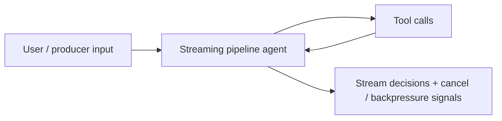
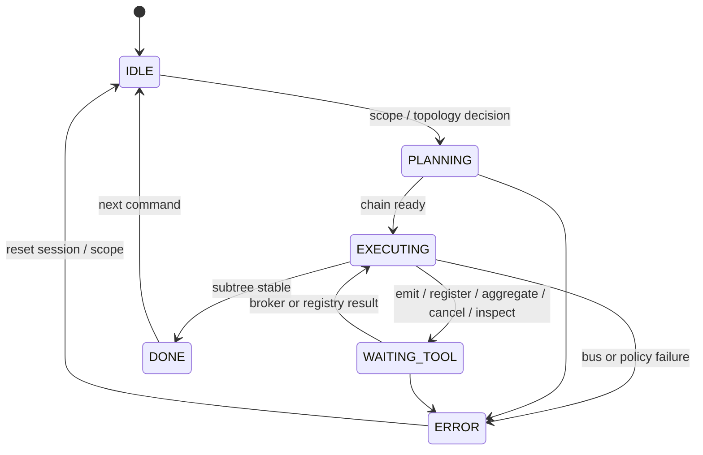

# Streaming Pipeline Agent (Event-Driven)

An agent that reasons about **unified event streams**, **interceptor chains**, **backpressure**, and **hierarchical cancellation**. It is designed for operators and runtime authors integrating high-throughput async pipelines where partial subtree teardown must not leak resources.

## Audience

Backend and platform engineers building **fan-out/fan-in** workers, streaming LLM token pipelines, or multi-stage enrichment graphs with cooperative cancellation.

## Quickstart

1. Mount `system-prompt.md` in your orchestrator.
2. Implement tools per `tools/*.md` against your event bus and telemetry.
3. Use `src/agent.py` as a reference for ordering: emit → intercept → aggregate → consume, with cancel propagation.

## Configuration

| Variable | Description |
|----------|-------------|
| `EVENT_BUS_ENDPOINT` | Logical or HTTP endpoint for the unified stream |
| `STREAM_ROOT_SCOPE_ID` | Default root for hierarchical cancellation |
| `BACKPRESSURE_METRICS_REF` | Where `inspect_backpressure` reads gauges |
| `MODEL_API_ENDPOINT` | Optional: agent’s own reasoning calls |

## Architecture

```
 +----------------+     emit_event      +----------------------+
 |   Producers    |-------------------->|  Unified event bus   |
 | (tasks, IO,    |                     |  (topics / partitions)|
 |  LLM chunks)   |                     +----------+-----------+
 +----------------+                                |
                                                   |  dispatch
                                                   v
                                        +----------------------+
                                        | Interceptor chain    |
                                        | (ordered middleware) |
                                        +----------+-----------+
                                                   |
                         register_interceptor ------+
                                                   |
                    +------------------------------+------------------------------+
                    |                              |                              |
                    v                              v                              v
           +----------------+            +----------------+            +----------------+
           | transform /    |            | filter / rate  |            | audit / policy |
           | enrich         |            | limit          |            | guardrails     |
           +--------+-------+            +--------+-------+            +--------+-------+
                    |                              |                              |
                    +------------------------------+------------------------------+
                                                   |
                                                   v
                                        +----------------------+
                                        | aggregate_stream     |
                                        | (windows, joins,      |
                                        |  session buffers)    |
                                        +----------+-----------+
                                                   |
                                                   v
                                        +----------------------+
                                        | Consumer(s)          |
                                        | + backpressure hooks |
                                        +----------+-----------+
                                                   |
                    cancel_subtree ----------------+
                    (propagate down scope tree)     |
                                                   v
                                        +----------------------+
                                        | Drained subtrees &   |
                                        | released buffers     |
                                        +----------------------+
```

## Failure modes

- **Backpressure:** consumers lag; interceptors must not unbounded-buffer.
- **Cancel storms:** `cancel_subtree` must be idempotent and scope-scoped.
- **Ordering:** partition keys must be explicit for `aggregate_stream`.

## Testing

See `tests/` for cancellation and interceptor ordering scenarios.

## Related files

- `system-prompt.md`, `tools/`, `src/agent.py`, `deploy/README.md`

## Runtime architecture (control flow)

Unified stream path and lifecycle states for event-driven orchestration.





## Environment matrix

| Variable | Required | Default | Description |
|----------|----------|---------|-------------|
| `EVENT_BUS_ENDPOINT` | yes | — | Broker or gateway for `emit_event` and subscriptions |
| `STREAM_ROOT_SCOPE_ID` | yes | — | Default root for hierarchical cancellation; guard against mass cancel |
| `BACKPRESSURE_METRICS_REF` | yes | — | Metrics source for `inspect_backpressure` |
| `INTERCEPTOR_REGISTRY_URI` | yes | — | Ordered interceptor registration source of truth |
| `MODEL_API_ENDPOINT` | no | — | Optional reasoning endpoint for the agent’s own LLM calls |

## Known limitations

- **Ordering:** Cross-partition ordering is not guaranteed unless partition keys are explicit for `aggregate_stream`.
- **Interceptor timeouts:** Long-running interceptors block the hot path; async handoff is required for heavy work.
- **Cancel semantics:** `cancel_subtree` effectiveness depends on consumer cooperation; leaked buffers require runtime-specific cleanup.
- **Bus availability:** If the event bus is partitioned or degraded, the agent cannot observe global backpressure accurately.
- **Payload caps:** Oversized `emit_event` payloads must be rejected at ingress; the agent does not fragment arbitrary binary streams.

## Security summary

- **Data flow:** Producers emit events into the bus; tools mutate interceptor registry, aggregates, and cancellation scopes; responses summarize operational state back to the operator.
- **Trust boundaries:** Authenticate `producer_id` at bus ingress; interceptors run with **elevated** access to payloads—treat them as part of your TCB; the agent’s model sees only what you pass into prompts.
- **Sensitive data:** Avoid logging full event bodies; classify topics and redact PII in audit hooks where regulations apply.

## Rollback guide

- **Undo interceptor changes:** Revert `INTERCEPTOR_REGISTRY_URI` to a known-good version or re-register prior `effective_order` from config history.
- **Undo cancel:** Subtree cancel is destructive for in-flight work; re-emit work with new `causation_id` after verifying consumers drained.
- **Audit:** Correlate `causation_id` across emit → interceptor → aggregate → consumer spans; retain broker offsets for forensic replay.
- **Recovery:** On `ERROR`, pause producers for the affected scope, inspect `inspect_backpressure` and partition lag, then resume after backlog is safe.

## Memory strategy

- **Ephemeral state (session-only):** Hypothetical event schemas, scratch topic names, latest lag snapshots from `inspect_backpressure`, and conversational clarifications. Stale lag readings should be discarded when superseded.
- **Durable state (persistent across sessions):** Committed `topic` / `schema_version` / `scope_id` decisions, interceptor **order_key** and registry revisions, SLO baselines stored via tools or config stores—not re-derived from chat alone.
- **Retention policy:** Redact or avoid retaining full PII-bearing payloads across sessions; align broker retention and aggregate window TTLs with org policy and `SECURITY.md`.
- **Redaction rules (PII, secrets):** Use redacted previews in answers and audit hooks; never persist credentials, signing keys, or raw auth headers in session summaries or event samples.
- **Schema migration for memory format changes:** Version event envelope and interceptor registration records; migrate registry snapshots when fields change; reject incompatible `schema_version` pairs at emit time per host rules.
