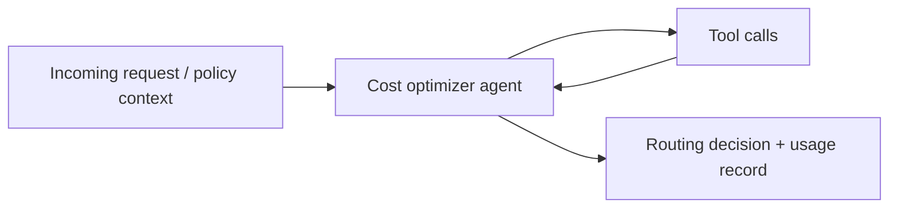

# Cost Optimizer Agent (Budget-Aware)

An agent that optimizes **model routing**, **token accounting**, and **cost circuit breakers** for high-volume LLM workloads. It balances latency, capability, and spend using explicit budgets rather than implicit heuristics.

## Audience

FinOps-aware ML platform teams and application owners who need **predictable bills**, **graceful degradation**, and **auditable routing decisions**.

## Quickstart

1. Load `system-prompt.md`.
2. Wire tools to your usage ledger and router service.
3. Integrate `src/agent.py` patterns into your gateway’s pre-flight checks.

## Configuration

| Variable | Description |
|----------|-------------|
| `BUDGET_LEDGER_URI` | Storage for spend and token counters |
| `MODEL_ROUTE_TABLE_REF` | Config mapping tiers to model ids |
| `CIRCUIT_BREAKER_POLICY_REF` | Thresholds for halt / downgrade |
| `MODEL_API_ENDPOINT` | Gateway base URL for routed calls (no secrets in repo) |

## Architecture

```
                    +------------------+
                    | Incoming request |
                    +--------+---------+
                             |
                             v
                    +------------------+
                    | estimate_cost    |
                    | (preflight $ /   |
                    |  token envelope) |
                    +--------+---------+
                             |
                             v
                    +------------------+
                    | check_budget     |
                    | (tenant / team / |
                    |   project caps)  |
                    +--------+---------+
                             |
               +-------------+-------------+
               |                           |
         under budget                 over / hot
               |                           |
               v                           v
      +----------------+           +----------------+
      | route_to_model |           | downgrade_model|
      | (fast vs cap.) |           | or hard break  |
      +--------+-------+           +--------+-------+
               |                           |
               +-------------+-------------+
                             |
                             v
                    +------------------+
                    | track_tokens     |
                    | (actual usage +  |
                    |  attribution)    |
                    +--------+---------+
                             |
                             v
                    +------------------+
                    | Circuit breaker  |
                    | re-eval (async)  |
                    +------------------+
```

## Policies

- **Tiered routing:** cheap path for classification; capable path for codegen.
- **Attribution:** every `track_tokens` row links to `request_id` and cost center.
- **Breakers:** soft downgrade before hard stop unless policy says otherwise.

## Testing

See `tests/` for budget exhaustion and downgrade behavior.

## Related files

- `system-prompt.md`, `tools/`, `src/agent.py`, `deploy/README.md`

## Runtime architecture (control flow)

Preflight routing and ledger updates with explicit lifecycle states.

```mermaid
stateDiagram-v2
  [*] --> IDLE
  IDLE --> PLANNING : classify request + load caps
  PLANNING --> EXECUTING : budget envelope ready
  EXECUTING --> WAITING_TOOL : estimate / check / route / track / breaker
  WAITING_TOOL --> EXECUTING : ledger + router callbacks
  EXECUTING --> DONE : decision committed
  EXECUTING --> ERROR : ledger or policy failure
  PLANNING --> ERROR
  WAITING_TOOL --> ERROR
  ERROR --> IDLE : fail closed or degrade per policy
  DONE --> IDLE : next request
```





## Environment matrix

| Variable | Required | Default | Description |
|----------|----------|---------|-------------|
| `BUDGET_LEDGER_URI` | yes | — | Append-only usage and spend store |
| `MODEL_ROUTE_TABLE_REF` | yes | — | Tier → model id routing matrix |
| `CIRCUIT_BREAKER_POLICY_REF` | yes | — | Thresholds, windows, and breaker actions |
| `PRICING_TABLE_REF` | yes | — | Versioned rates backing `estimate_cost` |
| `MODEL_API_ENDPOINT` | no | — | Gateway for the agent’s own optional LLM calls |
| `OPERATOR_OVERRIDE` | no | — | Break-glass downgrade path; restrict to elevated roles |

## Known limitations

- **Pricing staleness:** Cached `estimate_cost` can diverge from live provider invoices; refresh TTL on pricing snapshot change.
- **Attribution gaps:** Partial streams may under-count until `track_tokens` finalizes; reconciliation jobs may be required.
- **Breaker lag:** Async breaker evaluation can open/close after transient spikes already affected spend.
- **Model capability mismatch:** Downgraded routes may fail task-quality SLOs; automatic downgrade is not always safe for regulated outputs.
- **Ledger hot spots:** High-volume tenants can saturate a single shard without proper partitioning.

## Security summary

- **Data flow:** Request metadata flows through estimation and routing tools; counters and attribution land in `BUDGET_LEDGER_URI`; optional LLM calls use `MODEL_API_ENDPOINT`.
- **Trust boundaries:** The ledger and pricing tables are **authoritative** for billing posture; the LLM proposes routes but host policy should enforce caps; logs should minimize PII.
- **Sensitive data:** Hash or minimize attribution fields in logs; honor residency for ledger region; never embed API keys in environment values.

## Rollback guide

- **Undo routing change:** Revert `MODEL_ROUTE_TABLE_REF` to prior schema version; invalidate `estimate_cost` caches.
- **Undo ledger entries:** Use compensating entries or restore from backup; the agent does not auto-reverse `track_tokens`.
- **Audit:** Retain `request_id`, tenant/project ids, route decision ids, and breaker state transitions for FinOps review.
- **Recovery:** On `ERROR`, default to **deny** or last-known-safe route per `CIRCUIT_BREAKER_POLICY_REF`; verify ledger writable before re-enabling traffic.

## Memory strategy

- **Ephemeral state (session-only):** Scratch estimates, conversational what-if routes, interim tier choices before `track_tokens` confirms actuals, and transient headroom calculations.
- **Durable state (persistent across sessions):** Ledger rows, `request_id` linkage, committed **routing matrix** and **pricing** table versions, breaker policy revisions, and approved override ticket ids in host storage.
- **Retention policy:** Follow FinOps and privacy retention for ledgers; store prompt **hashes and sizes** per policy rather than full prompt bodies unless explicitly allowed; purge stale session scratch when the request completes.
- **Redaction rules (PII, secrets):** Do not place API keys or raw credentials in ledger notes or chat; hash or minimize attribution fields in logs; restrict who can read full attribution dimensions.
- **Schema migration for memory format changes:** Version ledger and routing config schemas; use dual-write or backfill jobs when fields change; reject unknown schema rows at ingest to avoid corrupt spend totals.
