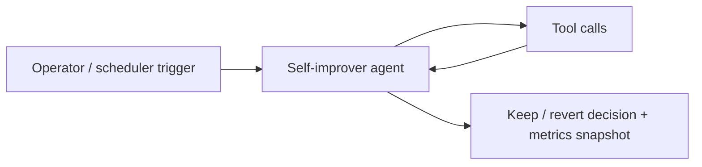

# Self-Improver Agent (Autoresearch Harness)

An agent that runs a **Karpathy-style loop** on its own instructions: **read** the current prompt, **hypothesize** improvements, **edit**, **evaluate** on fixed benchmarks, **compare** metrics, then **commit or revert** under governance.

## Audience

Research engineers and applied teams who want **controlled self-improvement** of system prompts with **reproducible evals** and **no silent production drift**.

## Quickstart

1. Load `system-prompt.md` (this file is the *outer* agent; the harness edits an **inner** prompt asset).
2. Point tools at your prompt registry and eval runner.
3. Use `src/agent.py` as the canonical loop ordering.

## Configuration

| Variable | Description |
|----------|-------------|
| `PROMPT_REGISTRY_URI` | Storage for prompt versions and diffs |
| `EVAL_SUITE_REF` | Benchmark suite manifest (tasks, graders) |
| `METRICS_STORE_URI` | Time-series or table for `compare_metrics` |
| `MODEL_API_ENDPOINT` | Model used for eval rollouts (secrets via host) |

## Architecture

```
 +------------------+
 | Karpathy loop    |
 +--------+---------+
          |
          v
 +------------------+       +------------------+
 | read_current_    |------>| edit_prompt      |
 | prompt           |       | (draft change)   |
 +------------------+       +--------+---------+
                                       |
                                       v
                             +------------------+
                             | run_evaluation   |
                             | (frozen suite)   |
                             +--------+---------+
                                       |
                                       v
                             +------------------+
                             | compare_metrics  |
                             | (baseline vs     |
                             |  candidate)      |
                             +--------+---------+
                                       |
                        +--------------+--------------+
                        |                             |
                        v                             v
               +----------------+            +----------------+
               | commit_or_     |            | commit_or_     |
               | revert KEEP    |            | revert DISCARD |
               +----------------+            +----------------+
```

## Governance

- **Frozen evals:** suite hash pinned per run.
- **Promotion:** human or automated gate on `compare_metrics`.
- **Rollback:** single command via `commit_or_revert`.

## Testing

See `tests/` for keep vs. discard decisions.

## Related files

- `system-prompt.md`, `tools/`, `src/agent.py`, `deploy/README.md`

## Runtime architecture (control flow)

Karpathy-style harness with explicit tool wait states.

```mermaid
stateDiagram-v2
  [*] --> IDLE
  IDLE --> PLANNING : pick candidate + suite pin
  PLANNING --> EXECUTING : edit staged
  EXECUTING --> WAITING_TOOL : read / edit / run_eval / compare / commit_or_revert
  WAITING_TOOL --> EXECUTING : registry + runner results
  EXECUTING --> DONE : harness cycle complete
  EXECUTING --> ERROR : eval or registry failure
  PLANNING --> ERROR
  WAITING_TOOL --> ERROR
  ERROR --> IDLE : abort; inner prompt unchanged or marked dirty
  DONE --> IDLE : await next scheduled run
```





## Environment matrix

| Variable | Required | Default | Description |
|----------|----------|---------|-------------|
| `PROMPT_REGISTRY_URI` | yes | — | Versioned prompt storage with hash concurrency control |
| `EVAL_SUITE_REF` | yes | — | Frozen benchmark manifest (tasks, graders) |
| `METRICS_STORE_URI` | yes | — | Run summaries and comparison indexes |
| `EVAL_RUNNER_ENDPOINT` | yes | — | Sandboxed executor for `run_evaluation` |
| `MODEL_API_ENDPOINT` | yes | — | Model access for eval rollouts (credentials via host) |
| `review_ticket_id` | no | — | Required in regulated flows for `commit_or_revert: keep` |

## Known limitations

- **Eval coverage:** A fixed suite may miss production regressions; suite hash pins reduce but do not eliminate blind spots.
- **Sandbox escape:** `EVAL_RUNNER_ENDPOINT` must be network-restricted; the agent cannot guarantee isolation without host controls.
- **Metric noise:** Small `compare_metrics` deltas can be statistically insignificant; gates should use thresholds and cohort sizes.
- **Dual prompts:** Confusion between outer harness prompt and inner editable asset can cause accidental edits; namespace separation is mandatory.
- **Cost:** Full eval sweeps are expensive; queue saturation surfaces as `RUNNER_BUSY`, delaying improvement cycles.

## Security summary

- **Data flow:** Harness reads prompts and suite fixtures, invokes the eval runner, writes metrics, and optionally commits prompt revisions to `PROMPT_REGISTRY_URI`.
- **Trust boundaries:** Treat the eval runner and registry as **high trust**; treat LLM-generated edits as **untrusted** until tests pass; production namespaces must be isolated from experiment namespaces.
- **Sensitive data:** Never ship customer production traffic into eval sandboxes; redact fixtures; protect `METRICS_STORE_URI` like internal analytics.

## Rollback guide

- **Undo keep:** Invoke `commit_or_revert` with **discard** if still mid-cycle; if already promoted, restore prior prompt revision from `PROMPT_REGISTRY_URI` using stored `rollback_handle` / version id.
- **Audit:** Log `run_id`, `candidate_id`, `suite` hash, `compare_report_id`, and gate decisions for every cycle.
- **Recovery:** On `ERROR`, mark candidate **aborted**, drain runner queue, verify suite manifest integrity, then rerun from `read_current_prompt` with a clean working copy.

## Memory strategy

- **Ephemeral state (session-only):** Draft diff text, local hypotheses, scratch metric tables before `compare_metrics` finalizes, and conversational planning notes.
- **Durable state (persistent across sessions):** `content_hash`, `prompt_id` versions, `suite_version`, `random_seed`, eval artifact URIs, `compare_report_id`, and `commit_or_revert` outcomes in `PROMPT_REGISTRY_URI` / `METRICS_STORE_URI`.
- **Retention policy:** Follow org policy for eval artifacts and prompt history; do not retain raw trajectories with PII in long-lived stores; align with `SECURITY.md` classification.
- **Redaction rules (PII, secrets):** Strip secrets and sensitive PII from prompts before `edit_prompt` and from any session summary; reference redacted artifact ids only.
- **Schema migration for memory format changes:** Version metrics reports and registry records; migrate stored artifacts when grader or prompt metadata schema changes; reject `keep` if baseline and candidate are not comparable under the same suite hash rules.
