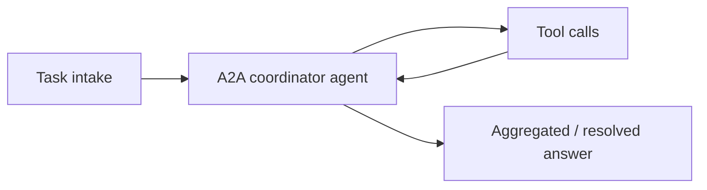
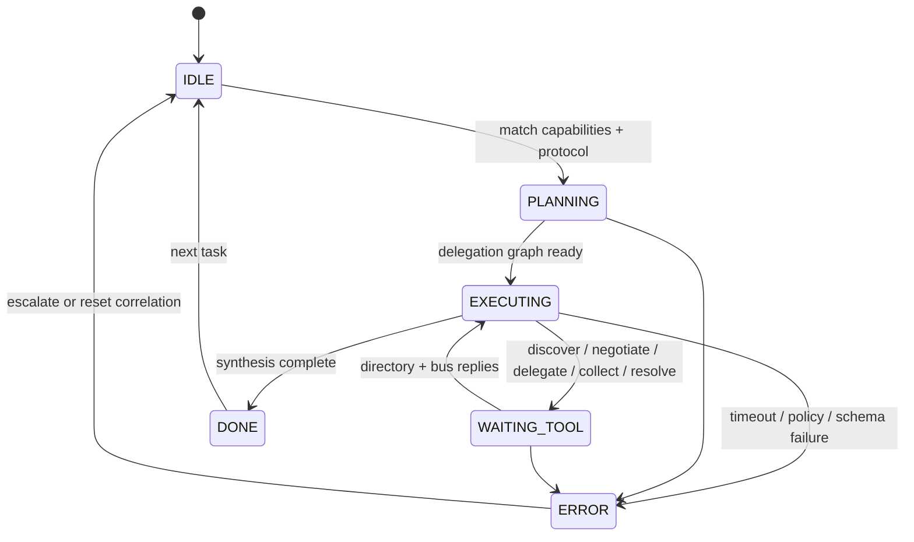

# A2A Coordinator Agent (Agent-to-Agent)

An agent that orchestrates **multi-agent work**: **discovers** peers, **negotiates** interaction protocols, **delegates** subtasks, **aggregates** results, and **resolves conflicts** when outputs disagree.

## Audience

Teams building **federated agent meshes** across services, vendors, or organizational boundaries where capabilities differ and contracts must be explicit.

## Quickstart

1. Load `system-prompt.md`.
2. Register tools against your agent directory and message bus.
3. Use `src/agent.py` as a reference orchestration loop.

## Configuration

| Variable | Description |
|----------|-------------|
| `AGENT_DIRECTORY_URI` | Capability registry and health |
| `A2A_MESSAGE_BUS_REF` | Transport for delegated tasks |
| `POLICY_GATE_REF` | Org rules for cross-agent data sharing |
| `MODEL_API_ENDPOINT` | Coordinator’s reasoning endpoint |

## Architecture

```
 +------------------+
 | Task intake      |
 +--------+---------+
          |
          v
 +------------------+     discover_agents     +------------------+
 | Capability       |------------------------>| Agent directory  |
 | matching plan    |                         | (skills, SLOs)     |
 +--------+---------+                         +------------------+
          |
          v
 +------------------+ negotiate_protocol +------------------+
 | Protocol         |-------------------->| Peer agents      |
 | selection        |                     | (schemas, auth)    |
 +--------+---------+                     +------------------+
          |
          v
 +------------------+ delegate_task +------------------+
 | Work breakdown   |-------------->| Workers          |
 | + partial orders |               | (parallel runs)  |
 +--------+---------+               +------------------+
          |                                  |
          v                                  v
 +------------------+ collect_results +------------------+
 | Aggregation      |<----------------| Result streams   |
 | + normalization  |                 | (typed payloads) |
 +--------+---------+                 +------------------+
          |
          v
 +------------------+ resolve_conflicts +------------------+
 | Final answer      |---------------->| Tie-breakers /   |
 | synthesis         |                 | human escalation |
 +------------------+-----------------+------------------+
```

## Principles

- **Explicit contracts:** JSON Schema or equivalent per delegation.
- **Least privilege:** data minimization in `delegate_task`.
- **Deterministic conflict policy:** prefer evidence-backed merges first.

## Testing

See `tests/` for protocol mismatch and conflict resolution.

## Related files

- `system-prompt.md`, `tools/`, `src/agent.py`, `deploy/README.md`

## Runtime architecture (control flow)

Multi-agent orchestration path and coordinator lifecycle states.





## Environment matrix

| Variable | Required | Default | Description |
|----------|----------|---------|-------------|
| `AGENT_DIRECTORY_URI` | yes | — | Capability registry and peer health for `discover_agents` |
| `A2A_MESSAGE_BUS_REF` | yes | — | Transport backing `delegate_task` and result collection |
| `POLICY_GATE_REF` | yes | — | Org rules for cross-agent data sharing and classification |
| `MODEL_API_ENDPOINT` | yes | — | Coordinator reasoning endpoint |
| `DELEGATE_TOKEN_ISSUER_REF` | no | — | Short-lived scoped credentials for workers |

## Known limitations

- **Partial results:** Slow or failed peers yield incomplete aggregates unless the merge policy explicitly handles gaps.
- **Schema drift:** Peers at mismatched `payload_schema_ref` versions fail negotiation; coordinated rollouts are required.
- **Non-determinism:** Conflict resolution may favor the wrong branch without evidence-backed tie-breakers or human escalation.
- **Bus limits:** Large `inputs_ref` payloads may exceed message size; indirection via object storage is not automatic.
- **Trust heterogeneity:** The coordinator cannot cryptographically verify peer behavior beyond transport auth and declared capabilities.

## Security summary

- **Data flow:** Tasks flow directory → bus → workers → aggregation; policy gate evaluates classification before enqueue; coordinator model sees handles and redacted summaries per configuration.
- **Trust boundaries:** **Untrusted** peers beyond mTLS/OAuth; **trusted** policy gate and token issuer; message bus as a controlled egress; never log full delegated payloads by default.
- **Sensitive data:** Classify `inputs_ref` before `delegate_task`; block regulated flows to public-tier agents; rotate delegate tokens aggressively.

## Rollback guide

- **Undo delegation:** Cancel downstream handles where the bus supports it; discard partial aggregates and re-run with `idempotency_key` if retries are safe.
- **Audit:** Retain `correlation_id`, `task_handle`, `protocol_id`, and resolution strategy per conflict for cross-team review.
- **Recovery:** On `ERROR`, drain stuck handles, bump schema version in staging first, then roll coordinator; temporarily switch conflict strategy to `human_escalation` for sensitive domains if needed.

## Memory strategy

- **Ephemeral state (session-only):** Draft decomposition, interim negotiation notes, partial `collect_results` snapshots until terminal, and conversational merge scratch.
- **Durable state (persistent across sessions):** `protocol_id`, delegation graph, Definition of Done, idempotency keys, final provenance maps, and ticket ids—stored by the runtime / bus integration, not only in chat.
- **Retention policy:** Strip peer chain-of-thought and secrets from long-lived logs; align message bus retention and directory snapshots with org policy and `SECURITY.md`.
- **Redaction rules (PII, secrets):** Never persist long-lived tokens in summaries; use vault-scoped handles; classify `inputs_ref` before persistence in coordinator audit trails.
- **Schema migration for memory format changes:** Version `payload_schema_ref` and protocol envelopes; staged rollout with negotiation compatibility checks; reject delegates that do not match the agreed schema version.
