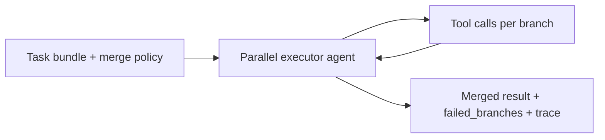
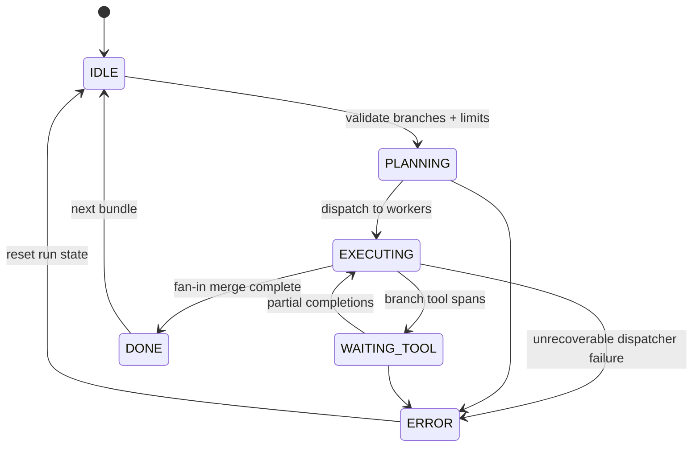

# Parallel Executor Agent

Runs independent subtasks concurrently, collects per-branch traces, and merges results with partial-failure recovery so the parent workflow can continue when some branches fail.

## Audience

- **Platform engineers** wiring multi-tool fan-out in agent runtimes.
- **Agent authors** who need deterministic merge semantics and traceable concurrency.
- **Operators** tuning worker pools, timeouts, and retry policies without changing task logic.

## Quickstart

1. Define a task bundle (ordered or keyed subtasks) and optional branch metadata.
2. Point the executor at your dispatcher config (worker count, per-branch timeout, merge strategy).
3. Invoke the agent; partial failures surface as `failed_branches` while successful branches merge into the combined result.
4. Inspect the unified trace via `trace_aggregate` for timelines and branch correlation.

```text
# Example invocation (conceptual)
parallel_executor.run(
  task_id="batch-001",
  branches=[{ "id": "a", "tool": "fetch" }, { "id": "b", "tool": "summarize" }],
  merge="fan_in_with_partial_ok"
)
```

## Configuration

| Variable | Description | Default |
|----------|-------------|---------|
| `PARALLEL_EXECUTOR_MAX_WORKERS` | Upper bound on concurrent branch executions | `8` |
| `PARALLEL_EXECUTOR_BRANCH_TIMEOUT_MS` | Per-branch wall-clock limit | `60000` |
| `PARALLEL_EXECUTOR_MERGE_STRATEGY` | `all_or_nothing`, `partial_ok`, or `first_success` | `partial_ok` |
| `PARALLEL_EXECUTOR_TRACE_RETENTION` | How many completed runs to retain traces for | `100` |
| `PARALLEL_EXECUTOR_RETRY_ATTEMPTS` | Retries for transient branch failures | `2` |
| `PARALLEL_EXECUTOR_LOG_LEVEL` | Logging verbosity for dispatcher and workers | `info` |

## Architecture

High-level data flow with partial failure recovery at fan-in:

```text
                    +------------------+
                    |      Task        |
                    +--------+---------+
                             |
                             v
                    +------------------+
                    | Fan-out          |
                    | dispatcher       |
                    +--------+---------+
                             |
           +-----------------+-----------------+
           |                 |                 |
           v                 v                 v
    +------------+   +------------+   +------------+
    | Worker 1   |   | Worker 2   |   | Worker N   |
    | (branch)   |   | (branch)   |   | (branch)   |
    +------+-----+   +------+-----+   +------+-----+
           |                 |                 |
           +-----------------+-----------------+
                             |
                             v
                    +------------------+
                    | Trace collector  |
                    | (branch IDs)     |
                    +--------+---------+
                             |
                             v
                    +------------------+
                    | Fan-in merger    |
                    | + partial        |
                    |   failure        |
                    |   recovery       |
                    +--------+---------+
                             |
                             v
                    +------------------+
                    | Merged result +  |
                    | unified trace    |
                    +------------------+
```

**Flow:** The dispatcher assigns each branch to a worker pool slot. The trace collector records start/end, errors, and tool spans per `branch_id`. The fan-in merger applies the configured strategy: successful branches contribute to the payload; failed branches are listed for retry or downstream handling without aborting the whole run when `partial_ok` is enabled.

## Testing

- **Unit:** Mock workers with fixed latency and injected failures; assert merge output and `failed_branches` cardinality.
- **Integration:** Run against a stub tool server; verify trace ordering and that `trace_aggregate` timelines align with wall-clock ordering per branch.
- **Chaos:** Random worker timeouts; confirm partial recovery and that `all_or_nothing` aborts the batch as expected.
- **Load:** Saturate `PARALLEL_EXECUTOR_MAX_WORKERS` and confirm backpressure and no trace loss under retention limits.

## Related files

- `tools/trace_aggregate.md` — unified timeline from concurrent tool traces
- Agent orchestration hooks (if present): `parallel_executor.yaml` / runtime adapter in your stack
- Parent factory-showcase index listing agent `16-parallel-executor`

## Runtime architecture (control flow)

Fan-out / fan-in execution with tool-mediated branches.





## Environment matrix

| Variable | Required | Default | Description |
|----------|----------|---------|-------------|
| `PARALLEL_EXECUTOR_MAX_WORKERS` | no | `8` | Upper bound on concurrent branch executions |
| `PARALLEL_EXECUTOR_BRANCH_TIMEOUT_MS` | no | `60000` | Per-branch wall-clock limit |
| `PARALLEL_EXECUTOR_MERGE_STRATEGY` | no | `partial_ok` | `all_or_nothing`, `partial_ok`, or `first_success` |
| `PARALLEL_EXECUTOR_TRACE_RETENTION` | no | `100` | Completed runs retained for trace inspection |
| `PARALLEL_EXECUTOR_RETRY_ATTEMPTS` | no | `2` | Retries for transient branch failures |
| `PARALLEL_EXECUTOR_LOG_LEVEL` | no | `info` | Dispatcher and worker log verbosity |
| `MODEL_API_ENDPOINT` | yes | — | Upstream LLM or router when the host uses LLM-backed planning merges |
| `PARALLEL_EXECUTOR_DEFAULT_CONCURRENCY` | yes | — | Initial cap on concurrent shard executions (`deploy/README.md`) |
| `PARALLEL_EXECUTOR_TRACE_STORE_REF` | yes | — | Durable trace storage (URI or vault path) |
| `PARALLEL_EXECUTOR_QUEUE_REF` | yes | — | Job queue or worker pool endpoint reference |

## Known limitations

- **Merge semantics:** `partial_ok` can return asymmetric payloads; downstream agents must handle `failed_branches` explicitly.
- **Determinism:** Wall-clock ordering in traces may not match logical causation under scheduler preemption.
- **Resource caps:** Saturating `PARALLEL_EXECUTOR_MAX_WORKERS` causes queueing; tail latency grows without backpressure signals to callers.
- **Idempotency:** Duplicate `correlation_id` fan-outs are rejected unless policy allows—retries need explicit keys.
- **Trace retention:** Old runs roll off under retention limits; forensic replay requires external archival.

## Security summary

- **Data flow:** Task bundles enter the dispatcher; each branch may invoke arbitrary registered tools; merged outputs and `trace_aggregate` views exit to the parent workflow.
- **Trust boundaries:** Branches are **isolated** logically but share worker pools—no cryptographic isolation; tool credentials are enforced by the host runtime, not this agent.
- **Sensitive data:** Traces may contain tool arguments and responses; restrict trace store ACLs and redact payloads in logs.

## Rollback guide

- **Undo merge:** Discard the merged artifact and re-run the bundle with a new `correlation_id` after fixing branch inputs; `all_or_nothing` runs have no partial artifact to keep.
- **Audit:** Use `trace_aggregate` with `branch_id` correlation and `correlation_id` for incident timelines; export traces before retention eviction.
- **Recovery:** On dispatcher `ERROR`, drain the queue, verify `PARALLEL_EXECUTOR_QUEUE_REF` and trace store health, then lower concurrency before replaying failed branches only.

## Memory strategy

- **Ephemeral state (session-only):** Scratch shard payloads, interim span excerpts, retry counters before `trace_aggregate` / `fan_in` complete, and conversational status notes.
- **Durable state (persistent across sessions):** `correlation_id`, applied concurrency cap version, `merge_strategy`, final merged artifact refs, and retained traces per `PARALLEL_EXECUTOR_TRACE_STORE_REF` / retention policy.
- **Retention policy:** Honor `PARALLEL_EXECUTOR_TRACE_RETENTION` and org archival rules; purge verbose child payloads from chat when tools hold canonical copies (`output_ref` only).
- **Redaction rules (PII, secrets):** Redact trace and merge summaries for logs; never embed credentials in `fan_out` payloads or trace annotations; tenant-isolate trace stores.
- **Schema migration for memory format changes:** Version trace envelope and merge result schemas; migrate stored traces when span fields change; reject `fan_in` inputs that fail schema validation to avoid corrupt merged artifacts.
