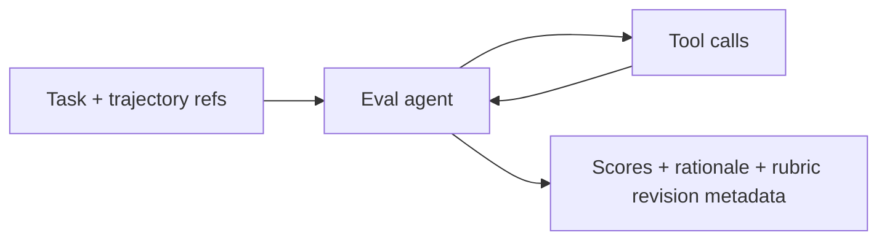
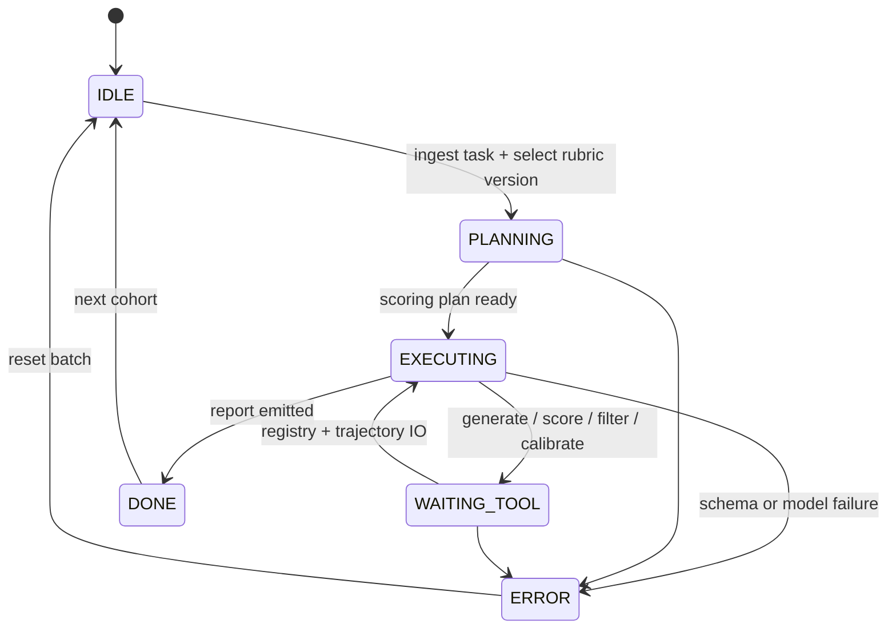

# Eval Agent (Adaptive Rubrics)

An **evaluation specialist** that synthesizes **task-specific rubrics**, scores multi-step trajectories, filters evidence by rubric dimensions, and **calibrates** scoring to reduce drift across models and prompts (AdaRubric-style workflow).

## Audience

ML platform teams and product engineers who need **repeatable quality gates** for agent traces, RAG answers, or tool-using runs—without hand-writing a new rubric for every task variant.

## Quickstart

1. Load `system-prompt.md`.
2. Mount tools under `tools/` with strict JSON schema validation.
3. Point `MODEL_API_ENDPOINT` at your evaluator model (may differ from the producer model).
4. Validate with `tests/rubric-calibration-filter-flow.md`.

## Configuration

| Variable | Description |
|----------|-------------|
| `EVAL_AGENT_MODEL_ENDPOINT` | Scoring model endpoint (alias allowed) |
| `EVAL_AGENT_RUBRIC_REGISTRY_REF` | Storage for versioned rubrics |
| `MODEL_API_ENDPOINT` | Fallback general model for rubric generation |

## Architecture

```
 +----------------+     +----------------------+
 | Task description|---->| Rubric generation    |
 +----------------+     | (criteria + weights) |
                        +----------+-----------+
                                   |
                                   v
                        +----------------------+
                        | Trajectory scoring   |
                        | (per-step + global)  |
                        +----------+-----------+
                                   |
           +------------------------+------------------------+
           |                        |                        |
           v                        v                        v
 +------------------+    +------------------+    +------------------+
 | Dimension filter |    | Score aggregation|    | Calibration pass |
 | (keep/drop ev.)  |    | (weighted mean)  |    | (anchor examples)|
 +------------------+    +------------------+    +------------------+
           \------------------------+------------------------/
                                    |
                                    v
                         +----------------------+
                         | Calibrated output    |
                         | (scores + rationale) |
                         +----------------------+
```

## Quality posture

- Rubrics are **versioned** and **frozen** before bulk scoring.
- Calibration uses **anchor trajectories** with adjudicated labels when available.
- Dimension filters prevent **overfitting** to verbose but irrelevant model chatter.

## Testing

See `tests/rubric-calibration-filter-flow.md`.

## Related files

- `system-prompt.md`, `tools/`, `src/agent.py`, `deploy/README.md`

## Runtime architecture (control flow)

Rubric lifecycle from task description to calibrated scores.





## Environment matrix

| Variable | Required | Default | Description |
|----------|----------|---------|-------------|
| `EVAL_AGENT_MODEL_ENDPOINT` | no | falls back to `MODEL_API_ENDPOINT` | Dedicated scoring model (separation of duties) |
| `EVAL_AGENT_RUBRIC_REGISTRY_REF` | yes | — | Versioned rubrics and calibration artifacts |
| `EVAL_AGENT_TRAJECTORY_STORE_REF` | yes | — | Read-only trajectory access for scoring |
| `MODEL_API_ENDPOINT` | yes | — | General model for rubric generation / rationales |

## Known limitations

- **Subjectivity:** Rubric dimensions remain judgments; inter-rater variance persists even after calibration.
- **Self-grading:** When scoring model equals producer model, bias is possible—policy may require separate endpoints.
- **Long trajectories:** Context windows truncate early steps; important evidence may be lost without chunking strategies.
- **Anchor dependency:** Calibration quality depends on adjudicated anchors; sparse anchors yield unstable scores.
- **Cost:** Full-cohort rescoring on every rubric bump is expensive; batching and sampling trade accuracy for spend.

## Security summary

- **Data flow:** Trajectories are read from `EVAL_AGENT_TRAJECTORY_STORE_REF`; rubrics written to registry; model calls may include excerpts—minimize PII in prompts.
- **Trust boundaries:** Trajectory store is **read-only** to the agent; registry is **trusted** for version integrity; scoring model is a **semi-trusted** processor of customer content.
- **Sensitive data:** Apply redaction profiles; enforce residency flags on stores; log `rubric_id` and span ids, not raw user text, where possible.

## Rollback guide

- **Undo rubric:** Pin scoring jobs to prior `revision` in `EVAL_AGENT_RUBRIC_REGISTRY_REF`; discard draft rubrics that never shipped.
- **Audit:** Record `rubric_id`, `revision`, score record ids, and cohort id for every report for reproducibility and disputes.
- **Recovery:** On `ERROR`, invalidate in-flight batch state, verify trajectory store read ACLs, then rerun scoring with frozen rubric hash only after registry consistency checks pass.

## Memory strategy

- **Ephemeral state (session-only):** Draft criterion wording, scratch scores before final `score_trajectory`, exploratory failure-mode notes, and in-thread comparison tables.
- **Durable state (persistent across sessions):** `rubric_id`, `rubric_revision`, anchor set references, batch score artifacts, calibration reports, and aggregate outputs in `EVAL_AGENT_RUBRIC_REGISTRY_REF` / metrics storage.
- **Retention policy:** Apply trajectory and score retention per privacy and ML governance; minimize long-lived copies of raw traces in chat; align with `SECURITY.md`.
- **Redaction rules (PII, secrets):** Redact trajectories before judge prompts where required; never echo secrets from traces; log ids (`rubric_id`, span ids) instead of raw user text by default.
- **Schema migration for memory format changes:** Version rubric JSON, score records, and calibration payloads; migrate registry entries on read or via batch jobs; pin scoring jobs to a rubric schema hash to avoid mixed-format aggregates.
