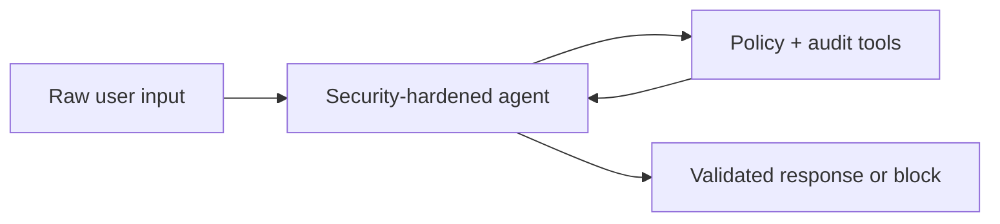

# Security-Hardened Agent

A **defense-in-depth** agent wrapper that sanitizes untrusted inputs, detects injection patterns, enforces **least-privilege** tool access, validates structured outputs, and emits **audit trails** suitable for regulated environments.

## Audience

Security engineers and platform teams who need an LLM agent that fails **closed** on ambiguous policy, never silently escalates privileges, and produces evidence for compliance reviews.

## Quickstart

1. Load `system-prompt.md` as the outer policy layer.
2. Implement tools in `tools/` as **mandatory gates** around a smaller inner agent.
3. Configure `MODEL_API_ENDPOINT` and policy bundle per `deploy/README.md`.
4. Run `tests/injection-denied-output-blocked.md`.

## Configuration

| Variable | Description |
|----------|-------------|
| `SECURITY_AGENT_POLICY_BUNDLE_REF` | Signed policy document location |
| `SECURITY_AGENT_AUDIT_SINK_REF` | Append-only audit log destination |
| `MODEL_API_ENDPOINT` | Inner model router (no secrets in env values) |

## Architecture

```
          +-------------+
          | Raw input   |
          +------+------+
                 |
                 v
          +-------------+
          | Sanitizer   |
          +------+------+
                 |
                 v
          +-------------------+
          | Injection detector|
          +---------+---------+
                    |
                    v
          +-------------------+
          | Permission check  |
          +---------+---------+
                    |
                    v
          +-------------------+
          |   Agent core      |
          | (narrow tools)    |
          +---------+---------+
                    |
                    v
          +-------------------+
          | Output validator  |
          +---------+---------+
                    |
                    v
          +-------------------+
          | Audit logger      |
          +-------------------+
                    |
                    v
          +-------------------+
          | Released response |
          +-------------------+
```

## Guarantees (design targets)

- **Default deny** for tools not explicitly allowed for the session principal.
- **Schema-first** outputs: validator rejects malformed or oversized payloads.
- **Tamper-evident** audit entries with hash chaining where supported by the sink.

## Testing

See `tests/injection-denied-output-blocked.md`.

## Related files

- `system-prompt.md`, `tools/`, `src/agent.py`, `deploy/README.md`

## Runtime architecture (control flow)

Defense-in-depth gate sequence around the inner agent.

```mermaid
stateDiagram-v2
  [*] --> IDLE
  IDLE --> PLANNING : load session principal + policy slice
  PLANNING --> EXECUTING : gates armed
  EXECUTING --> WAITING_TOOL : sanitize / detect / permit / validate / audit
  WAITING_TOOL --> EXECUTING : gate results
  EXECUTING --> DONE : response released
  EXECUTING --> ERROR : policy or sink failure
  PLANNING --> ERROR
  WAITING_TOOL --> ERROR
  ERROR --> IDLE : fail closed; alert
  DONE --> IDLE : next request
```





## Environment matrix

| Variable | Required | Default | Description |
|----------|----------|---------|-------------|
| `SECURITY_AGENT_POLICY_BUNDLE_REF` | yes | — | Signed policy document location (rotation supported) |
| `SECURITY_AGENT_AUDIT_SINK_REF` | yes | — | Append-only audit destination |
| `MODEL_API_ENDPOINT` | yes | — | Inner model router (narrow tool surface) |
| `SECURITY_AGENT_INJECTION_MODE` | no | `hybrid` | `fast_rules`, `hybrid`, or `full` detector profile |

## Known limitations

- **Probabilistic detection:** Model-assisted injection signals can false positive/negative; rules alone miss novel attacks.
- **Policy expressiveness:** Complex org policies may not map cleanly to static bundles; exceptions need workflow outside the agent.
- **Performance:** Full validation and audit shipping can add latency; async audit may delay forensic completeness by seconds.
- **Inner agent trust:** The inner core remains an LLM—output validation reduces but does not eliminate semantic exfiltration.
- **Supply chain:** Compromised policy bundle or schema registry undermines all gates; signature verification is mandatory but not sufficient alone.

## Security summary

- **Data flow:** Raw input → sanitizer → detector → permission check → inner agent → output validator → audit sink → released response.
- **Trust boundaries:** Policy bundle and KMS-backed signing keys are **high trust**; user content is **untrusted**; inner model is **bounded** by allowlisted tools; audit sink is **append-only evidence**.
- **Sensitive data:** Minimize payload content in audit entries where law permits; use hash chaining when the sink supports tamper evidence; break-glass roles must auto-expire.

## Rollback guide

- **Undo policy promotion:** Roll back `SECURITY_AGENT_POLICY_BUNDLE_REF` to last signed bundle; restart workers to drop stale policy cache.
- **Undo allowlist mistakes:** Patch policy JSON/YAML and redeploy; emergency **deny-all** mode is host-specific—document in your runbook.
- **Audit:** Retain `severity`, principal id, tool id, decision, and optional content hashes; correlate with incident tickets for red-team findings.
- **Recovery:** On `ERROR` from audit sink, enter degraded mode that **blocks** releases if policy requires fail-closed; restore sink availability before re-enabling traffic.

## Memory strategy

- **Ephemeral state (session-only):** Sanitized working copy of the active turn, interim scan summaries, one-shot validation errors, and conversational clarifications.
- **Durable state (persistent across sessions):** `audit_log` entries, permission decisions, redacted fingerprints, and policy bundle version ids—written only via tools to compliant storage.
- **Retention policy:** Follow security and legal retention for audit logs; shorter retention for ephemeral scan caches; never extend retention of raw secrets in memory.
- **Redaction rules (PII, secrets):** Fingerprints or hashed identifiers in audit entries only; no cookies, recovery codes, or raw auth headers in chat or logs.
- **Schema migration for memory format changes:** Version audit event schema and validator contracts; dual-write or replay old events through adapters; fail closed if audit sink rejects unknown schema in regulated modes.
