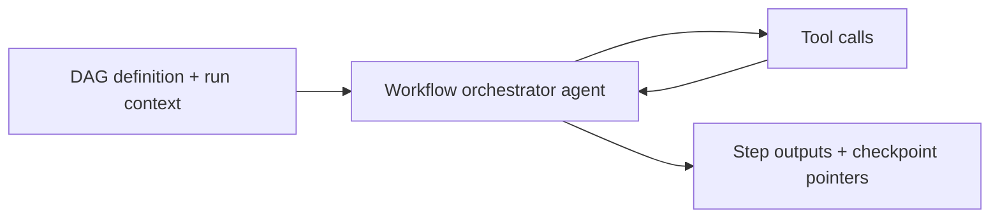
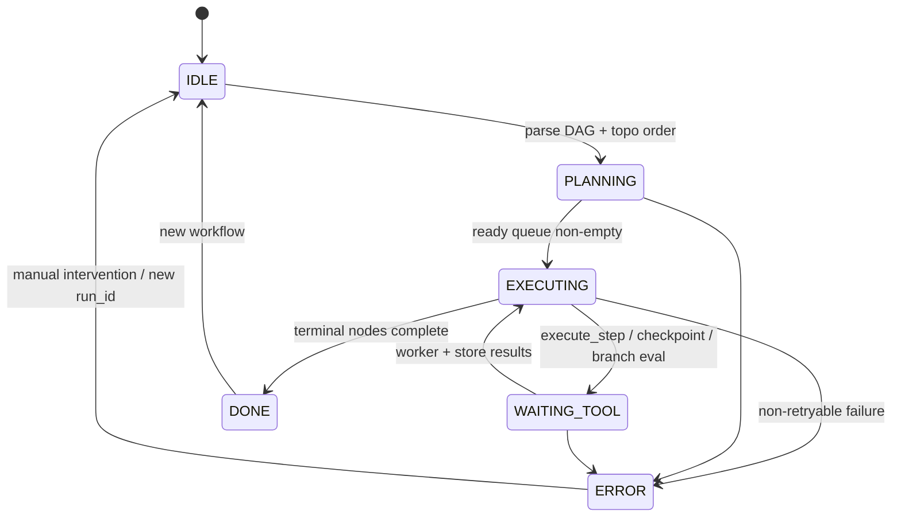

# Workflow Orchestrator Agent

A **DAG-backed workflow engine** for tool-using agents: explicit dependencies, **topological execution**, conditional branching, durable **checkpointing**, and **resume** after process restarts or partial failures.

## Audience

Automation engineers who outgrew linear chains and need predictable execution order, idempotent steps, and operational visibility into in-flight workflows.

## Quickstart

1. Load `system-prompt.md`.
2. Implement tools from `tools/` against your state store and worker queue.
3. Configure checkpoint storage via `WORKFLOW_CHECKPOINT_REF` (see `deploy/README.md`).
4. Run `tests/dag-branch-resume.md`.

## Configuration

| Variable | Description |
|----------|-------------|
| `WORKFLOW_CHECKPOINT_REF` | Durable key-value or object prefix for checkpoints |
| `WORKFLOW_EXECUTOR_REF` | Worker endpoint for `execute_step` |
| `MODEL_API_ENDPOINT` | Planner for DAG edits and condition expressions |

## Architecture

```
 +----------------+
 | DAG definition |
 +--------+-------+
          |
          v
 +-------------------+
 | Topological sort  |
 +---------+---------+
           |
           v
 +-------------------+
 | Step executor     |
 | (parallel layers) |
 +---------+---------+
           |
     +-----+-----+
     |           |
     v           v
+----------------+  +-------------------+
| Checkpoint mgr |  | Condition evaluator |
+--------+-------+  +---------+---------+
         |                    |
         +---------+----------+
                   |
                   v
         +-------------------+
         | Resume handler    |
         | (replay/skip ok)  |
         +-------------------+
```

## Execution semantics

- Steps are **idempotent** when `step_id` + `run_id` repeat.
- Checkpoints capture **outputs hash** and **branch taken** for each conditional edge.
- Resume replays **only** missing or failed steps unless `force` flags override policy.

## Testing

See `tests/dag-branch-resume.md`.

## Related files

- `system-prompt.md`, `tools/`, `src/agent.py`, `deploy/README.md`

## Runtime architecture (control flow)

DAG planning, execution, and resume with checkpointed tool calls.





## Environment matrix

| Variable | Required | Default | Description |
|----------|----------|---------|-------------|
| `WORKFLOW_CHECKPOINT_REF` | yes | — | Durable prefix for checkpoints and output hashes |
| `WORKFLOW_EXECUTOR_REF` | yes | — | Worker fabric backing `execute_step` |
| `MODEL_API_ENDPOINT` | yes | — | Planner for DAG edits and condition expressions |
| `WORKFLOW_AUDIT_REF` | no | — | Separate audit stream for branch decisions |

## Known limitations

- **Idempotency contract:** Replay safety requires workers to honor `step_id` + `run_id` semantics; side-effecting steps need explicit compensations not modeled here.
- **Clock skew:** Condition evaluation should prefer logical sequence numbers over wall clock for distributed workers.
- **Graph size:** Very large DAGs stress planner context and checkpoint size; consider subgraph workflows.
- **Conditional edges:** Mis-specified conditions can skip critical steps; human review of generated DAGs is still advised.
- **Executor availability:** Checkpoint progress stalls if `WORKFLOW_EXECUTOR_REF` is partitioned; resume does not heal broken workers.

## Security summary

- **Data flow:** DAG definitions and run context enter the planner; checkpoints and step outputs persist to `WORKFLOW_CHECKPOINT_REF`; workers receive least data needed per step.
- **Trust boundaries:** Checkpoint store is **sensitive** (may hold PII outputs); executor is **trusted** to enforce tenancy; LLM-produced DAG edits are **untrusted** until validated by schema and policy.
- **Sensitive data:** Encrypt checkpoints at rest; restrict audit stream access; avoid logging full step payloads.

## Rollback guide

- **Undo workflow progress:** Delete or restore checkpoint keys for `run_id` from backup; **do not** edit graphs for in-flight runs—bump `revision` and start a new run instead.
- **Audit:** Record branch taken, output hashes, and `retry_attempt` per `step_id` when `WORKFLOW_AUDIT_REF` is enabled.
- **Recovery:** On `ERROR`, identify last successful checkpoint, fix upstream data or worker fault, then resume **only** missing/failed steps per policy; watch for rising `retry_attempt` alerts.

## Memory strategy

- **Ephemeral state (session-only):** Draft node lists, scratch facts for `evaluate_condition`, and conversational explanations before committing to checkpoints.
- **Durable state (persistent across sessions):** `run_id`, DAG revision, `checkpoint_id`, `cursor`, `output_ref` chain, and branch decisions under `WORKFLOW_CHECKPOINT_REF` / optional `WORKFLOW_AUDIT_REF`.
- **Retention policy:** Encrypt and TTL checkpoints per data class; avoid indefinite retention of PII-bearing step outputs; align with `SECURITY.md` and compliance schedules.
- **Redaction rules (PII, secrets):** Do not place secrets in chat summaries; reference `output_ref` only; redact audit payloads where full outputs are prohibited.
- **Schema migration for memory format changes:** Version DAG and checkpoint record schemas; migrate checkpoints on read or via offline jobs; never resume a `run_id` if checkpoint schema is incompatible without an explicit migration path.
