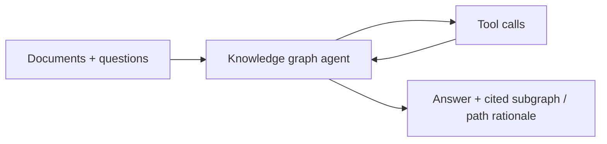
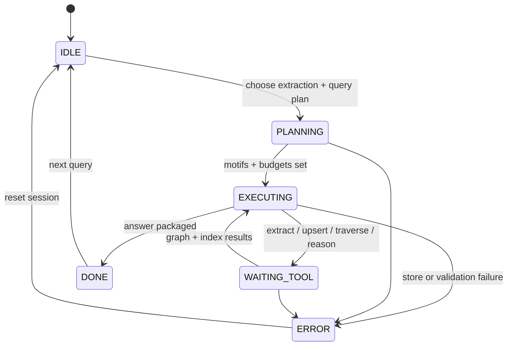

# Knowledge Graph Agent

An **entity–relation** reasoning agent that extracts structured concepts from documents, maps **typed relationships**, persists them in a graph store, runs **bounded traversals**, and answers questions via **subgraph retrieval** plus path-level reasoning.

## Audience

Data teams and research copilots that need explainable answers grounded in an evolving knowledge graph rather than flat chunk retrieval alone.

## Quickstart

1. Load `system-prompt.md`.
2. Wire `tools/` to your NLP pipeline, graph database, and embedding index.
3. Configure `GRAPH_STORE_REF` per `deploy/README.md`.
4. Validate with `tests/extract-traverse-reason-path.md`.

## Configuration

| Variable | Description |
|----------|-------------|
| `GRAPH_STORE_REF` | Graph DB connection reference (vault) |
| `GRAPH_EMBED_INDEX_REF` | Vector index for entity linking |
| `MODEL_API_ENDPOINT` | Model for extraction and reasoning summaries |

## Architecture

```
 +----------------+
 | Document input |
 +--------+-------+
          |
          v
 +-------------------+
 | Entity extractor  |
 +---------+---------+
           |
           v
 +-------------------+
 | Relationship      |
 | mapper            |
 +---------+---------+
           |
           v
 +-------------------+
 | Graph store       |
 +---------+---------+
           |
     +-----+-----+
     |           |
     v           v
+----------------+   +-------------------+
| Query engine   |   | Path reasoner     |
| (subgraph)     |   | (multi-hop logic) |
+----------------+   +-------------------+
           \           /
            v         v
         +----------------+
         | Final answer   |
         +----------------+
```

## Design notes

- Entities carry **provenance** (doc id, offsets) for auditability.
- Traversals are **budgeted** by hop count and edge types to contain cost.
- Reasoning outputs label **inference vs observed** edges explicitly.

## Testing

See `tests/extract-traverse-reason-path.md`.

## Related files

- `system-prompt.md`, `tools/`, `src/agent.py`, `deploy/README.md`

## Runtime architecture (control flow)

Document-to-graph ingestion, retrieval, and reasoning.





## Environment matrix

| Variable | Required | Default | Description |
|----------|----------|---------|-------------|
| `GRAPH_STORE_REF` | yes | — | Graph database credentials reference (vault) |
| `GRAPH_EMBED_INDEX_REF` | yes | — | Vector index for entity linking |
| `MODEL_API_ENDPOINT` | yes | — | Model for extraction and reasoning summaries |
| `GRAPH_QUERY_TIMEOUT_MS` | no | host-defined | Server-side cap for traversals and motifs |

## Known limitations

- **Extraction error:** Wrong entities propagate as false edges; offline reconciliation and human review loops are still required.
- **Graph density:** Dense graphs explode traversal cost even with hop limits; motifs must be curated.
- **Embedding drift:** Entity linking quality degrades when the embed model or index schema changes without reindex.
- **Reasoning vs ground truth:** Path-level reasoning can overfit to spurious edges unless **inference vs observed** is labeled consistently.
- **Compliance deletes:** GDPR-style deletes require provenance on every edge; batch extraction without `document_ref` breaks erasure.

## Security summary

- **Data flow:** Documents enter extraction; embeddings and graph mutations flow to `GRAPH_EMBED_INDEX_REF` and `GRAPH_STORE_REF`; queries return bounded subgraphs to the model for summarization.
- **Trust boundaries:** Graph store and index are **authoritative** for structure; LLM extractions are **untrusted** until validated; disallow ad-hoc graph query languages—use `motif_ref` and compiled patterns only.
- **Sensitive data:** Classify documents before ingest; restrict traverse results by tenant; audit who queried which `document_ref`.

## Rollback guide

- **Undo writes:** Revert transactional batch or restore graph snapshot; compensate by deleting entities/edges keyed by errant `document_ref`.
- **Audit:** Retain extraction job ids, `document_ref`, motif ids, and traversal budgets for each answer.
- **Recovery:** On `ERROR`, verify store and index connectivity, reload motif allowlist bundle, then re-run extraction idempotently with the same provenance keys where supported.

## Memory strategy

- **Ephemeral state (session-only):** Chunk-level extraction scratch, candidate edges before `map_relationships` confirms, conversational paraphrases of the user question, and partial subgraph previews in-thread.
- **Durable state (persistent across sessions):** Canonical entity ids, committed edges with `document_ref` provenance, embedding index entries, and query results materialized in `GRAPH_STORE_REF` / `GRAPH_EMBED_INDEX_REF`.
- **Retention policy:** Respect document and graph retention for compliance deletes (e.g. GDPR); align traversal logs with org policy; see `SECURITY.md` for classification.
- **Redaction rules (PII, secrets):** Classify attributes before ingest; strip or tokenize PII on entities when policy requires; never write secrets into node properties or chat summaries.
- **Schema migration for memory format changes:** Version entity/edge schemas and motif definitions; reindex or batch-migrate graph and vector payloads when types or embed models change; gate reads/writes on compatible schema versions.
